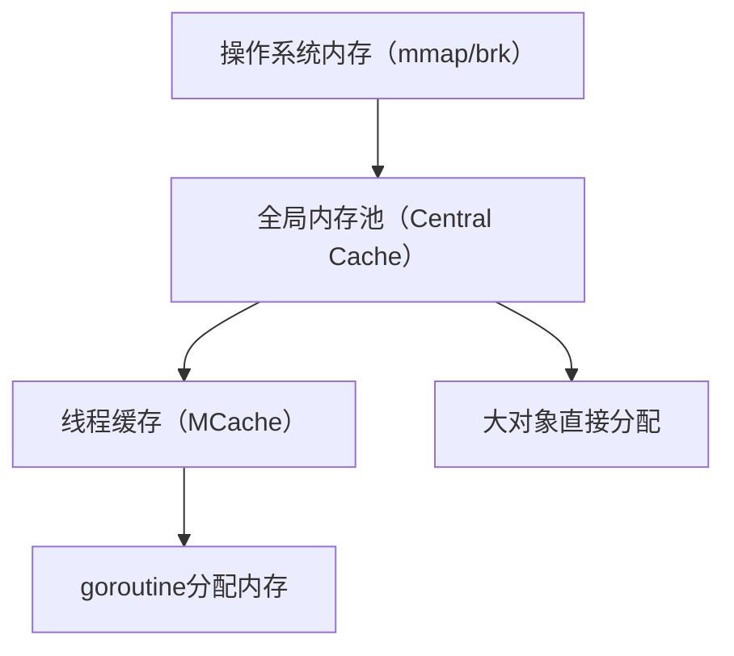
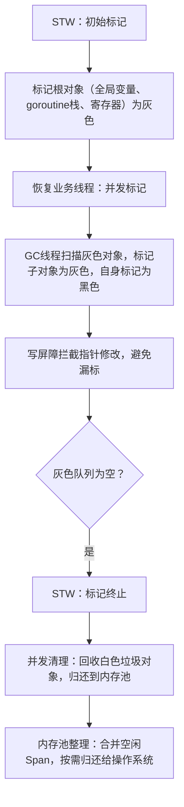

# go语言的内存管理机制
这是理解Go程序性能、GC行为的核心——Go的内存管理结合了**预分配、分级缓存、并发分配、垃圾回收**四大核心，既兼顾了高性能，又保证了开发的简洁性（无需手动管理内存）。

我会从“内存分配”和“内存回收”两大核心模块展开，讲解Go内存管理的底层设计、核心组件和关键特性，让你清楚Go是如何分配、使用、回收内存的。

### 一、Go内存管理的核心目标
Go内存管理由**运行时（runtime）** 负责，核心目标：
1. **低延迟分配**：高频小对象分配时，避免系统调用（mmap/brk），直接从预分配内存池中获取；
2. **高并发安全**：多goroutine分配内存时，减少锁竞争，提升并发性能；
3. **低开销回收**：通过高效GC（三色标记法）回收无用内存，且STW时间极短；
4. **开发友好**：无需手动malloc/free，编译器+运行时自动管理。

### 二、内存分配（核心：分级缓存+预分配）
Go的内存分配借鉴了TCMalloc（Thread-Caching Malloc）的设计，核心是“分级缓存”，避免多线程竞争全局内存池，提升分配效率。

#### 1. 内存分级结构（从底层到上层）


##### （1）全局内存池（Central Cache）
- 由Go运行时管理，是连接操作系统和线程缓存的中间层；
- 内存被划分为**固定大小的内存块（Span）**：Span是内存分配的基本单位，大小为8KB的整数倍（如8KB、16KB、32KB...）；
- 每个Span会被标记为“空闲/已分配”，并按内存块大小分类（如8B、16B、32B...256KB），对应不同大小的对象分配。

##### （2）线程缓存（MCache）
- 每个OS线程（M）绑定一个专属的MCache，goroutine运行在M上时，优先从MCache分配内存；
- MCache缓存了不同大小的Span，**无锁分配**（线程私有），是Go高频小对象分配高效的核心；
- 当MCache中的某个大小的Span耗尽时，会从全局内存池（Central Cache）批量申请Span，补充到MCache。

##### （3）大小对象划分
Go将分配的对象分为三类，分配策略不同：
| 对象类型 | 大小范围 | 分配策略 |
|----------|----------|----------|
| 微对象 | <16B | 从TCache的“微型分配器”分配（合并多个微对象到一个Span，减少碎片） |
| 小对象 | 16B ~ 32KB | 从MCache的对应大小Span中分配（无锁，最快） |
| 大对象 | >32KB | 直接从全局内存池申请大Span，或通过mmap向操作系统申请（需加全局锁，但频率低） |

#### 2. 内存分配流程（以小对象为例）
1. goroutine需要分配一个24B的对象；
2. 从当前M绑定的MCache中，查找24B对应的空闲Span；
3. 若Span有空闲内存块，直接分配（无锁，纳秒级）；
4. 若Span无空闲，MCache向全局内存池申请一批24B的Span；
5. 全局内存池若有空闲Span，直接分配给MCache；若无，则通过mmap向操作系统申请新内存，划分成Span后分配。

#### 3. 关键优化：内存对齐+逃逸分析
- **内存对齐**：所有对象分配时按8B/16B对齐，提升CPU缓存命中率（如24B对象实际分配32B，避免跨缓存行）；
- **逃逸分析**（编译器阶段）：判断对象是分配在栈上还是堆上：
  - 栈分配：对象仅在当前goroutine内使用，且大小固定→分配到goroutine栈（无需GC，栈销毁时自动回收，效率最高）；
  - 堆分配：对象跨goroutine使用、大小不固定→分配到堆（需GC回收）。

**示例：逃逸分析影响分配位置**
```go
// 栈分配：对象仅在函数内使用，大小固定
func stackAlloc() {
    var a int = 10 // 栈分配，无需GC
}

// 堆分配：对象逃逸到函数外（返回指针）
func heapAlloc() *int {
    a := 10
    return &a // a逃逸到堆，需GC回收
}
```

### 三、内存回收（核心：并发三色标记GC）
Go的内存回收就是我们之前聊过的**并发三色标记+混合写屏障**，这里结合内存管理整体梳理核心流程：

#### 1. GC触发时机
- **内存阈值触发**：堆内存使用量达到“上次GC后堆内存的25%”（可通过`GOGC`调整，`GOGC=100`为默认，值越大GC频率越低）；
- **定时触发**：若2分钟未触发GC，强制触发（避免内存泄漏导致内存暴涨）；
- **手动触发**：调用`runtime.GC()`主动触发（适合业务低峰期）；
- **内存硬限制触发**：达到`GOMEMLIMIT`设置的内存上限时触发。

#### 2. GC核心流程（简化版）


#### 3. 内存回收的关键优化
- **混合写屏障**：防止并发标记时漏标存活对象，保证GC正确性；
- **辅助GC（Mutator Assist）**：当内存分配速度超过GC标记速度时，让业务goroutine协助GC标记，避免内存暴涨；
- **大对象优化**：大对象（>32KB）单独管理，回收时直接释放，无需进入Span缓存；
- **内存归还**：空闲Span达到阈值时，通过munmap归还给操作系统，减少内存占用（避免“内存常驻”）。

### 四、Go内存管理的核心特性对比（vs Java/C++）
| 特性 | Go | Java | C++ |
|------|----|------|-----|
| 分配方式 | 分级缓存（MCache+Central Cache）+ 栈/堆分配 | 堆分配为主（新生代/老年代）+ 栈分配（局部变量） | 手动malloc/free + 栈分配 |
| 并发分配 | 线程私有MCache，无锁分配小对象 | 多线程竞争堆内存，需锁/TCMalloc优化 | 手动加锁，易出现竞态 |
| 回收方式 | 并发三色标记GC（低STW） | 分代GC（G1/ZGC低STW） | 手动回收，易内存泄漏 |
| 开发成本 | 无手动管理，逃逸分析自动优化 | 无手动管理，需调优GC参数 | 手动管理，易出错 |
| 内存碎片 | 有（但Span复用缓解） | 分代GC+整理，碎片少 | 手动管理，碎片可控 |

### 五、Go内存管理的性能调优建议
1. **优先栈分配**：编写代码时让对象尽可能在栈上分配（如避免返回局部对象指针、减少大对象跨函数使用）；
2. **减少高频小对象分配**：复用对象池（`sync.Pool`）缓存高频分配的小对象，降低GC压力；
   ```go
   // 示例：使用sync.Pool复用对象
   var objPool = sync.Pool{
       New: func() interface{} {
           return &MyObject{} // 初始化对象
       },
   }

   // 获取对象
   obj := objPool.Get().(*MyObject)
   // 使用后放回池
   objPool.Put(obj)
   ```
3. **合理设置GOMEMLIMIT**：容器化部署时，设置`GOMEMLIMIT`为容器内存上限的80%-90%，避免OOM；
4. **调整GOGC**：计算密集型应用可增大`GOGC`（如`GOGC=200`），降低GC频率；高并发应用保持默认即可；
5. **监控内存指标**：通过`runtime.ReadMemStats`或`pprof`监控堆内存使用、GC次数、STW时间，定位内存泄漏/过度分配。

### 总结
1. Go内存管理核心是“**分级缓存分配+并发三色标记回收**”：分级缓存保证低延迟分配，并发GC保证低STW回收；
2. 分配层面：小对象从线程私有MCache无锁分配，大对象直接从全局池分配，栈分配优先于堆分配；
3. 回收层面：通过三色标记+混合写屏障实现低STW并发GC，辅助GC和内存归还优化进一步提升性能；
4. 调优核心：利用逃逸分析优化栈分配、复用对象池、合理配置GC参数，平衡内存使用和GC开销。

简单来说，Go的内存管理做到了“开发友好性”和“性能”的平衡——无需手动管理内存，又通过分级缓存和低STW GC保证了高并发场景下的性能。


