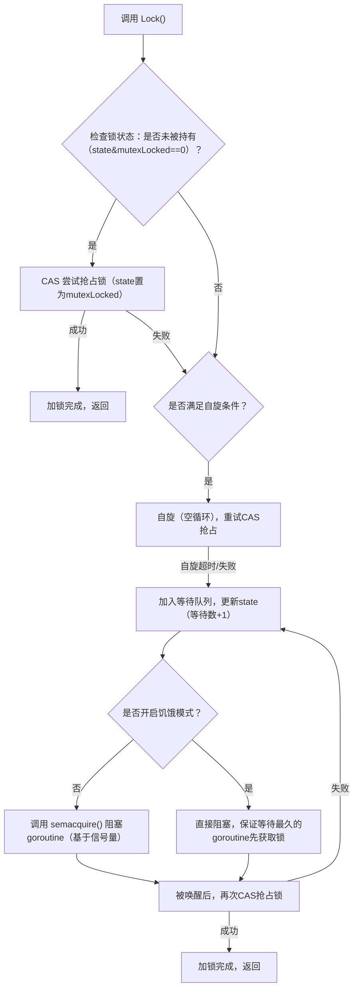

golang的原语:atomic、sync。
<!--more-->

本篇将简单介绍golang的sync库。含sync.map, sync/atomic

# sync/Mutex
runtime：cas、自旋
linux futex：cas、cas失败后才wait，当其他M 调用futex的release，会唤醒被挂起的M
futex性能优于SystemV、POSIX


Go 的锁（以最核心的 `sync.Mutex` 为例）是**结合了自旋锁、信号量（semaphore）、饥饿模式**的混合锁机制，兼顾了高并发下的性能和公平性，底层直接调用 Linux 内核/系统调用实现，我会从核心锁类型（Mutex/RWMutex）、底层原理、关键机制、源码级逻辑四个维度讲清楚，确保新手也能理解。

### 一、先明确：Go 锁的核心分类与适用场景
Go 标准库 `sync` 包提供的核心锁类型，底层实现各有侧重：
| 锁类型       | 核心用途                | 底层核心实现                |
|--------------|-------------------------|-----------------------------|
| `sync.Mutex` | 互斥锁（排他锁）| 自旋锁 + 信号量 + 饥饿模式  |
| `sync.RWMutex` | 读写锁（多读单写）| 基于 `Mutex` + 读计数 + 写等待队列 |
| `sync.Once`  | 保证代码只执行一次      | 基于 `Mutex` + 状态标记     |
| `sync.WaitGroup` | 等待一组 goroutine 完成 | 基于信号量（semaphore）|

下面重点讲最基础、最核心的 `sync.Mutex`（互斥锁）实现，这是所有 Go 锁的基础。

### 二、sync.Mutex 底层核心原理（Go 1.8+ 饥饿模式）
`sync.Mutex` 不是单一锁类型，而是**自适应自旋 + 信号量阻塞**的混合模型，核心目标是：
- 低竞争时：用自旋锁减少上下文切换，提升性能；
- 高竞争时：用信号量阻塞 goroutine，避免 CPU 空转；
- 极端饥饿时：开启饥饿模式，保证锁的公平性。

#### 1. 核心状态标记（Mutex 结构体关键字段）
```go
type Mutex struct {
    state int32  // 锁状态：低3位表示锁状态（locked/woken/starving），其余位表示等待goroutine数
    sema  uint32 // 信号量，用于阻塞/唤醒goroutine
}

// state 低3位定义：
const (
    mutexLocked = 1 << iota // 1：锁已被持有
    mutexWoken              // 2：有goroutine被唤醒
    mutexStarving           // 4：锁进入饥饿模式
    mutexWaiterShift = iota // 3：等待者数量的偏移位（从第3位开始计数）
)
```

#### 2. 核心执行逻辑（加锁 `Lock()`）
`Mutex.Lock()` 的执行流程是一个**优先级递减**的尝试过程，我用流程图简化：


#### 3. 关键机制拆解（新手必懂）
##### （1）自旋锁（Spin Lock）
- **什么是自旋**：goroutine 不放弃 CPU，而是空循环（几微秒），重试获取锁；
- **自旋条件**（必须同时满足）：
  1. CPU 核数 > 1（否则自旋无意义，浪费CPU）；
  2. 当前 goroutine 自旋次数 < 4 次（避免过度自旋）；
  3. 锁的等待者数量少（或未开启饥饿模式）；
- **作用**：低竞争时，避免 goroutine 切换到内核态阻塞（切换成本约 1~2 微秒），提升性能。

##### （2）信号量（Semaphore）
- 当自旋失败/不满足自旋条件时，Go 会调用底层 `semacquire()` 函数（runtime 层），最终调用 Linux 内核的 `futex` 系统调用；
- `futex` 是 Linux 轻量级同步原语，能让 goroutine 从用户态切换到内核态**阻塞**，释放 CPU；
- 解锁时调用 `semrelease()`，通过 `futex` 唤醒等待队列中的 goroutine。

##### （3）饥饿模式（Go 1.8+ 新增）
- **问题**：高竞争下，新到来的 goroutine 可能“插队”抢占锁，导致老 goroutine 一直等待（饿死）；
- **饥饿模式触发条件**：一个 goroutine 等待锁超过 1ms；
- **饥饿模式规则**：
  1. 锁直接交给等待最久的 goroutine，新 goroutine 不允许自旋/插队；
  2. 持有锁的 goroutine 解锁时，必须唤醒等待队列的第一个 goroutine；
  3. 当等待队列空/最后一个等待者获取锁且等待时间 < 1ms 时，退出饥饿模式。

#### 4. 解锁逻辑（Unlock()）
解锁是一个**清理状态 + 唤醒等待者**的过程：
1. 先通过 CAS 把 `state` 中的 `mutexLocked` 位清零；
2. 检查是否有等待者（state 中等待数 > 0）；
3. 若有等待者：
   - 非饥饿模式：调用 `semrelease()` 唤醒一个等待的 goroutine；
   - 饥饿模式：直接把锁交给等待队列第一个 goroutine，当前 goroutine 不唤醒其他 goroutine。

### 三、sync.RWMutex（读写锁）底层实现
RWMutex 是“多读单写”锁，底层基于 Mutex 实现，核心逻辑：
1. **读锁（RLock()）**：
   - 先检查是否有写锁持有/写等待者：若没有，直接增加读计数（state 高位）；
   - 若有写锁/写等待者，调用 `runtime_SemacquireRWMutexR()` 阻塞；
2. **写锁（Lock()）**：
   - 先调用 `Mutex.Lock()` 获取互斥锁，保证排他性；
   - 再等待所有读锁释放（读计数清零），然后标记写锁持有；
3. **解锁**：
   - 读解锁（RUnlock()）：读计数减 1，若计数为 0 且有写等待者，唤醒写 goroutine；
   - 写解锁（Unlock()）：释放 Mutex，唤醒所有等待的读/写 goroutine。

### 四、Go 锁 vs 操作系统锁（关键区别）
Go 的锁不是直接用操作系统的 pthread 互斥锁，而是：
1. **用户态优先**：先尝试自旋（用户态），失败才进入内核态阻塞；
2. **goroutine 粒度**：阻塞的是 goroutine，而非操作系统线程（M），切换成本更低；
3. **自适应优化**：根据竞争情况自动切换自旋/阻塞/饥饿模式，无需用户配置。

### 五、核心注意事项（新手避坑）
1. **不要重复解锁**：`Mutex.Unlock()` 若调用时锁未被持有，会触发 panic；
2. **避免锁拷贝**：Mutex 是值类型，拷贝后会丢失锁状态（需传指针）；
3. **自旋不是万能的**：高竞争场景下，自旋会浪费 CPU，Go 会自动停止自旋；
4. **饥饿模式的代价**：开启饥饿模式后，性能会略有下降，但保证了公平性。

### 总结
1. Go 核心锁 `sync.Mutex` 是**自旋锁 + 信号量 + 饥饿模式**的混合实现，兼顾性能与公平性；
2. 加锁时优先尝试 CAS 抢占，满足条件则自旋，失败则通过信号量阻塞 goroutine；
3. 饥饿模式解决高竞争下的“插队”问题，保证等待最久的 goroutine 优先获取锁；
4. `RWMutex` 基于 `Mutex` 实现，支持多读单写，适合读多写少的场景；
5. Go 锁是 goroutine 粒度的，比操作系统线程锁切换成本更低，更适配 Go 协程模型。

这些底层逻辑是 Go 并发编程的核心，理解后能更好地排查死锁、性能瓶颈等问题。


# sync/atomic
atomic 是golang对于一些基础数据类型的同步操作的实现。官方的基本介绍如下：
```
Package atomic provides low-level atomic memory primitives useful for implementing synchronization algorithms.

These functions require great care to be used correctly. Except for special, low-level applications, synchronization is better done with channels or the facilities of the sync package. Share memory by communicating; don't communicate by sharing memory.
```
翻译过来就是：atomic包提供了低层次的同步内存操作。atomic的函数需要小心使用。同时，官方建议说除非有特殊情况，否则应该使用channel或sync包提供的工具来实现同步操作。“通过沟通共享内存，不要通过共享内存进行通信”。这是golang的设计原则。

atomic声明了基本数据类型的同步操作。如:


可见atomic包只有函数的声明，并无具体实现。针对不同的系统架构，函数的具体实现不同（使用）。下面是CompareAndSwapInt64在amd64的具体实现（go/1.10.3/libexec/src/sync/atomic/asm_amd64.s）：
```
TEXT ·CompareAndSwapInt64(SB),NOSPLIT,$0-25
	JMP	·CompareAndSwapUint64(SB)

TEXT ·CompareAndSwapUint64(SB),NOSPLIT,$0-25
	MOVQ	addr+0(FP), BP  // 将第一个参数放到BP寄存器
	MOVQ	old+8(FP), AX // 将old值放入AX寄存器
	MOVQ	new+16(FP), CX // 将new值放入CX寄存器
	LOCK             // 锁定下面两条指令对应的总线
	// CMPXCHG r/m,r 将累加器AL/AX/EAX/RAX中的值与首操作数（目的操作数）比较，如果相等，
  // 第2操作数（源操作数）的值装载到首操作数，zf置1。如果不等， 首操作数的值装载到AL/AX/EAX/RAX并将zf清0  
	CMPXCHGQ	CX, 0(BP)  // compare and swap
	SETEQ	swapped+24(FP)
	RET
```
可见，对于atomic函数的具体实现是和系统架构相关的（不同的体系架构有不同的指令集）。当编译golang程序的时候，会将CompareAndSwapInt64函数链接到该机器指令。相较于使用系统级的锁，直接使用机器指令进行原子操作消耗更小（无需系统陷入等一系列系统操作）。

LOCK 前缀指令（注意：它不是独立指令，是指令前缀）的作用 —— 它是 x86 CPU 提供的 “原子性保障开关”，核心作用是让后续的内存操作指令（如 CMPXCHGQ、ADD、XCHG）在多核心场景下具备全局原子性，是多核 CPU 同步的底层硬件基础。
- 早期实现：总线锁定（Bus Lock），其他核无法无法运行
- 现代实现：缓存锁定（Cache Lock），其他核只要不写该缓存行，则可以继续运行

# sync.Map
go 语言中的map并不是并发安全的，在Go 1.6之前，并发读写map会导致读取到脏数据，在1.6之后则程序直接panic。因此之前的解决方案一般都是通过引入RWMutex(读写锁)进行处理，关于go为什么不支持map的原子操作，概况来说，对map原子操作一定程度上降低了只有并发读，或不存在并发读写等场景的性能。
但作为服务端来说，使用go编写服务,大部分情况下都会存在gorutine并发访问map的情况，因此，1.9之后，go 在sync包下引入了并发安全的map。

Map是golang对map的封装，能够提供较高性能的读写负载。其具体结构如下：
```
type Map struct {
	mu Mutex
	read atomic.Value // 存储就是一个readOnly实例
	dirty map[interface{}]*entry
	misses int // 命中失败次数
}

type readOnly struct {
	m       map[interface{}]*entry
	amended bool // true if the dirty map contains some key not in m.
}
type entry struct {
	p unsafe.Pointer // *interface{}
}
// 存储一个k-v，如果k已经存在则覆盖
func (m *Map) Store(key, value interface{})
// 存储一个k-v，如果k已经存在则返回旧值
func (m *Map) LoadOrStore(key, value interface{}) (actual interface{}, loaded bool)
// 删除一个k-v
func (m *Map) Delete(key interface{})
// 遍历k-v
func (m *Map) Range(f func(key, value interface{}) bool)
```
可见该结构十分简单。其主要思想是：
- read只负责读操作
- dirty只负责写操作
- 查询的时候先在read中查询；当在read中找不到的时候，加锁，再到dirty中找，如果找到则返回，且misses加一
- 当misses达到一定值，则将dirty上升为read
- 虽然read和ditry是一个map，但是由于v为指针，因此当修改一个已经存在的k的时候，read和dirty对应的k-v会同时改变

下面我们来分析一下Store的实现：
```
// Store sets the value for a key.
func (m *Map) Store(key, value interface{}) {
	read, _ := m.read.Load().(readOnly)
	// 如果read中存在，则直接更新, 会同时更新read, dirty
	if e, ok := read.m[key]; ok && e.tryStore(&value) {
		return
	}
  // 加锁
	m.mu.Lock()
  // 再读一次read，防止加锁之前其他routine将dirty上升为read
	read, _ = m.read.Load().(readOnly)
  // 该key曾经被刷入到read
	if e, ok := read.m[key]; ok {
    // 这个key之前被删除过
		if e.unexpungeLocked() {
			m.dirty[key] = e
		}
		e.storeLocked(&value)
	} else if e, ok := m.dirty[key]; ok {
		e.storeLocked(&value)
	} else {
		// 如果dirty包含了不在read中的k-v
		if !read.amended {
      // 正在往dirty存入第一个key
		  // dirtyLocked当dirty为空的时候会初始化
			m.dirtyLocked()
			m.read.Store(readOnly{m: read.m, amended: true})
		}
		m.dirty[key] = newEntry(value)
	}
	m.mu.Unlock()
}
```
Load的实现也与Store基本相似：先在read里面找；找不到则加锁在dirty里面找
```
func (m *Map) Load(key interface{}) (value interface{}, ok bool) {
	read, _ := m.read.Load().(readOnly)
	e, ok := read.m[key]
	// 找不到则加锁在dirty里面找
	if !ok && read.amended {
		m.mu.Lock()
		// 在找dirty之前，先从read中再找一次，原因同Store
		read, _ = m.read.Load().(readOnly)
		e, ok = read.m[key]
		if !ok && read.amended {
			e, ok = m.dirty[key]
			m.missLocked()
		}
		m.mu.Unlock()
	}
	if !ok {
		return nil, false
	}
	return e.load()
}
```
分析：
- 能够较好的支持高并发读
- sync.Map不适合高并发写的情况。大量的写操作会导致read命中失败，然后加锁；同时如果命中失败过多，则dirty和read会频繁交换


其他：golang的原语除了atomic、sync之外，channel也可以算是。channel的实现比较简单，完全可以看源码来学习（会牵涉到一些routine的知识）。关于channel的实现、源码分析，网上有很多都分析的非常好：
- [源码](https://github.com/golang/go/blob/master/src/runtime/chan.go)
- [Go Channel 源码剖析](http://legendtkl.com/2017/08/06/golang-channel-implement/)
