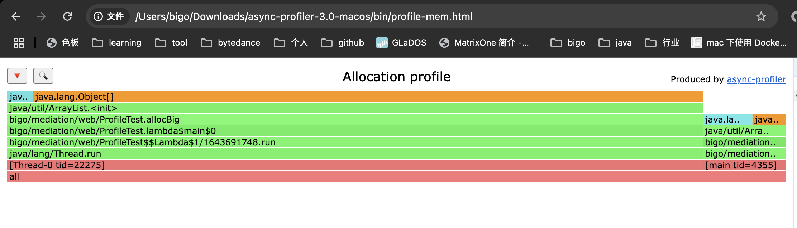
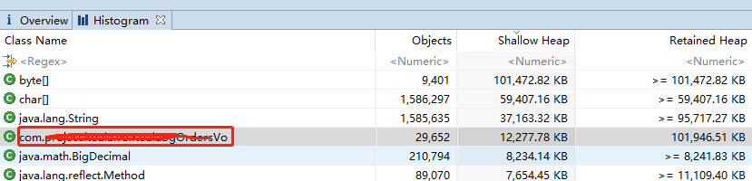
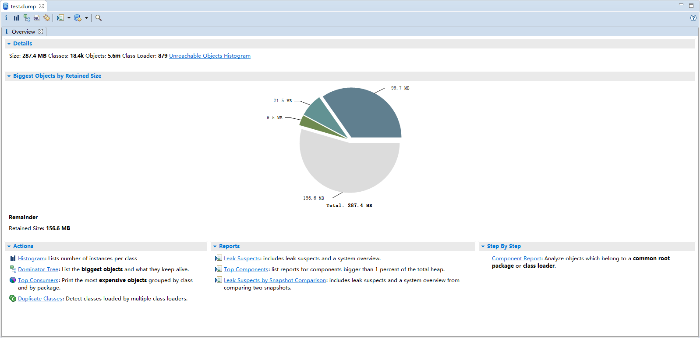
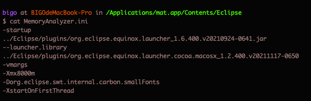
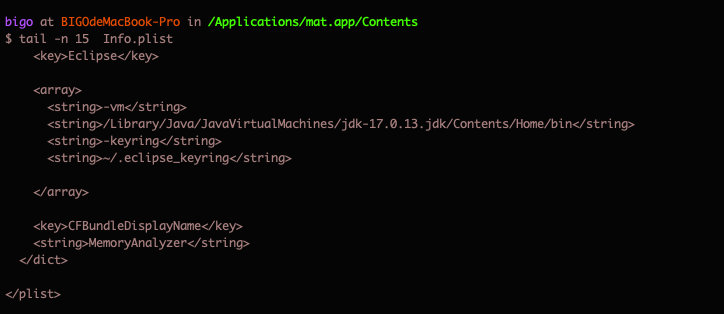

# GC分析
参考：https://www.cnblogs.com/uestc2007/p/16309640.html

## YoungGC过程理解
新生代内存按照8:1:1的比例分为一个eden区和两个survivor(survivor0,survivor1)区。一个Eden区，两个 Survivor区。新new出来的对象会存储在 Eden(伊甸园)中，当这区域满了之后JVM会进行一次垃圾回收，在回收时把有用的对象存储在S1区，没用的就销毁此对象的内存空间，这过程即第一次YoungGC，如果S1区空间也满了后，同理会将有用的对象会放到S2区中，并释放S1空间，以上反复的回收即为YoungGC。


## FullGC过程理解
年轻代空间满了之后，会将满足一定活跃度的对象放到Old区中(对象活跃度：每个对象满足JVM默认count=15之后就判断是活跃对象，每次YoungGC后会将存活对象生命中+1，直到=15就转到Old区，这个次数可以通过：-XX:MaxTenuringThreshold来配置)， 由于Full GC需要对整个堆进行回收，导致应用访问变慢，因此应该尽可能减少Full GC的次数。

## 分析
jstat -gcutil PID 1000 表示每隔1s执行一次

```sh
bigo at BIGOdeMacBook-Pro in ~/givenzeng.github.io/计算机/language/java (main) (venv)
$ jps
43600 Launcher
65024 MacLauncher
43601 WebV2Application
42247 Launcher
16744
43465 NailgunRunner
20618 Launcher
43610 Jps
82255 Main

bigo at BIGOdeMacBook-Pro in ~/givenzeng.github.io/计算机/language/java (main) (venv)
$ jstat -gcutil 82255 5000
  S0     S1     E      O      M     CCS    YGC     YGCT    FGC    FGCT     GCT
     - 100.00  39.34  53.86  98.77  95.42  91647  756.019     2    0.702  756.721
     - 100.00  41.80  53.86  98.77  95.42  91647  756.019     2    0.702  756.721
^C%
```

S0：幸存1区当前使用比例
S1：幸存2区当前使用比例
E：伊甸园区使用比例
O：老年代使用比例
M：元数据区使用比例
CCS：压缩使用比例
YGC：年轻代垃圾回收次数
YGCT：年轻代垃圾回收消耗时间
FGC：老年代垃圾回收次数
FGCT：老年代垃圾回收消耗时间
GCT：垃圾回收消耗总时间


如果 S0 、S1、 伊甸园区 这三个空间都有值的时候说明可能存在问题。因为正常情况下是每次GC后，S0区、S1区中的空间总有一个是会被完全清空（根据GC垃圾回收算法），因此S0 S1一直存在被占用时则回收不彻底，导致内存泄漏现象，随之时间拉长，甚至出现内存溢出（OOM）现象。


如果短时间内，FGC次数过多（比如10～30分钟一次比较合理），需要业务代码分析定位。
- 频繁创建大对象：大对象（如大数组、大集合）会直接进入老年代，如果这类对象频繁创建，老年代空间很快就会被填满，从而触发 Full GC
- 随着程序的运行，老年代中的对象会不断增多，当老年代空间不足时，就会触发 Full GC。这可能是因为对象在新生代经历多次 Minor GC 后仍然存活，进而进入老年代，或者是动态生成的类加载过多，元空间（Java 8 及以后版本）或永久代（Java 7 及以前版本）空间不足。
- 内存泄漏指的是对象不再被使用，但由于某些原因（如静态集合持有对象引用、未关闭的资源等）无法被垃圾回收。典型就是内存使用不断增长。


通过以下方式可以查看各个区的内存使用量

```sh
# 默认情况jstat展示单位为Byte
bigo at BIGOdeMacBook-Pro in ~/givenzeng.github.io/计算机/language/java (main) (venv)
$ jstat -gc 82255
 S0C    S1C    S0U    S1U      EC       EU        OC         OU       MC     MU    CCSC   CCSU   YGC     YGCT    FGC    FGCT     GCT
 0.0   5120.0  0.0   4992.1 133120.0 98304.0  1958912.0   982197.5  476800.0 470932.1 59456.0 56730.8  91648  756.065   2      0.702  756.767


# 按MB展示
bigo at BIGOdeMacBook-Pro in ~/givenzeng.github.io/计算机/language/java (main) (venv)
$ jstat -gc 82255 | awk '{printf "S0: %.2fM, S1: %.2fM, E: %.2fM, O: %.2fM, M: %.2fM, CCS: %.2fM\n", $4/1024, $5/1024, $6/1024, $7/1024, $10/1024, $12/1024}'


S0: 0.00M, S1: 0.00M, E: 0.00M, O: 0.00M, M: 0.00M, CCS: 0.00M
S0: 8.00M, S1: 127.00M, E: 31.00M, O: 1913.00M, M: 459.89M, CCS: 55.40M
```


# Profile

https://cloud.tencent.com/developer/article/1554194
https://github.com/async-profiler/async-profiler

```sh
# 查看运行中的java 进程
jps 
# 采样30s：cpu
sudo ./asprof -t -i 10 -d 30 -f profile-cpu.html $PID # cpu
# 采样30s：内存
sudo ./asprof -t -i 10 -e alloc -d 30 -f profile-mem.html $PID
# 锁分析
sudo ./asprof -t -i 10  -e lock -d 30 -f profile-lock.html $PID
```

其他选项：
-  -i 选项可以指定采样频率，单位为毫秒。例如，-i 10 表示每 10 毫秒采样一次。
- -t 选项可以分析特定线程。例如，分析线程 ID 为 1234 的线程。默认情况下，只分析 Java 主线程。-t 1234
- -t：分析所有线程的性能

运行以下样例：
```java
public class ProfileTest {
    public static void main(String[] args) throws InterruptedException {
        new Thread(() -> {
            try {
                while (true){
                    allocBig();
                }
            } catch (InterruptedException e) {
                throw new RuntimeException(e);
            }
        }).start();

        try {
            while (true) {
                allocSmall();
            }
        } catch (InterruptedException e) {
            throw new RuntimeException(e);
        }
    }
    // 模拟申请大内存
    public static void allocBig() throws InterruptedException {
        List<Long> l = new ArrayList<>(100*1000);
    }
    // 模拟申请小内存
    public static void allocSmall() throws InterruptedException {
        List<Long> l = new ArrayList<>(50*1000);
    }
}
```
从下图可以看到，一共有两个线程，其中子线程占用内存最多，主要是allocBig方法上。



虽然 Async Profiler 的开销较低，但在高并发、高性能的系统中，长时间的分析可能会对系统性能产生一定的影响。因此，建议在测试环境或低峰期进行性能分析。


# jmap
通过火焰图已经能判断大部分问题了。但是如果一个函数有多个变量占用内存，那具体哪个变量占用的比较大呢？具体的内存占用量是多少？（profile只能展示占用比例）

```sh
jps
# 使用 JDK 提供的 jmap 工具，命令是 jmap -dump:format=b,file=文件名 进程号。
# 当进程接近僵死时，可以添加 -F 参数强制转储：jmap -F -dump:format=b,file=文件名 进程号。
jmap -dump:format=b,file=mem.hprof $PID
jmap -F -dump:format=b,file=mem.hprof $PID
```

产出的文件包含了整个java进程的内存快照。可以使用mat分析。（如果是生产环境，比较麻烦的是如何将mem.hprof下载下来。）



另外，mat对内存要求比较多，因此一般我们给mat分配的内存是hprof文件大小的1.2倍以上(通过修改MemoryAnalyzer.ini中的-Xmx配置，重启mat进程)。


通过一下配置设置jdk路径



Histogram视图
以Class Name为维度，分别展示各个类的对象数量，Shallow Size，Retained size。这里有一个疑惑是，Shallow Size和Retained size没有显示是以什么为单位的，它默认是以byte为单位的