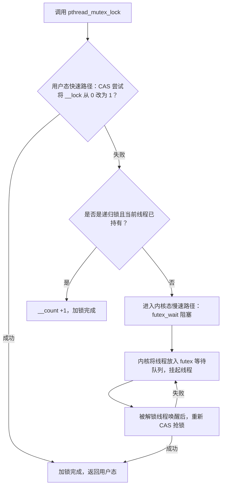
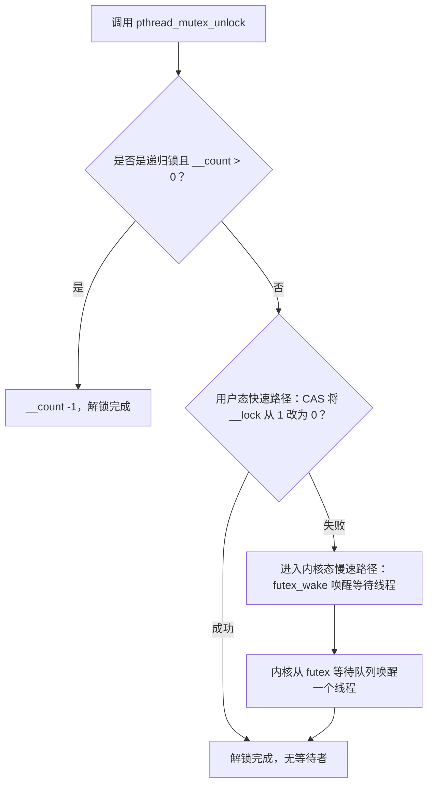

你想搞懂 pthread 互斥锁（`pthread_mutex_t`）的底层原理——它是 Linux 下线程同步的核心工具，本质是**基于 futex（Fast Userspace Mutex）实现的“混合锁”**：无竞争时在用户态用原子指令完成加解锁，有竞争时通过 futex 陷入内核态阻塞，兼顾性能和正确性。

我会从「核心结构」「加解锁流程」「关键机制」「和 Go 锁的对比」四个维度讲透，你会发现它和 Go `sync.Mutex` 的设计思路高度相似（因为都基于 futex）。

---

## 一、先明确：pthread 互斥锁的核心定位
pthread 互斥锁是 POSIX 标准定义的线程级互斥锁，用于保护临界区（同一时间只有一个线程能执行），其底层实现依赖 Linux 内核的 futex 机制，核心目标：
- **无竞争时**：用户态原子操作完成，无系统调用开销；
- **有竞争时**：内核态阻塞等待，避免 CPU 空转；
- **保证公平性**：避免线程“饿死”（可选公平锁模式）。

---

## 二、pthread_mutex_t 的核心结构（简化版）
pthread 互斥锁的底层结构体（不同 glibc 版本略有差异）核心字段如下（以 x86_64 为例）：
```c
// 简化版 pthread_mutex_t 结构
typedef struct {
    int __lock;          // 锁状态：0=未持有，1=已持有，负数=有等待者
    unsigned int __count; // 递归锁的计数（PTHREAD_MUTEX_RECURSIVE 模式）
    int __owner;         // 持有锁的线程 ID（TID）
    int __nusers;        // 使用该锁的线程数
    // 指向 futex 等待队列的关键字段（关联内核 futex 变量）
    void *__align;       // 对齐到缓存行，避免伪共享
} pthread_mutex_t;
```
核心字段是 `__lock`：
- `__lock = 0`：锁未被持有，可抢占；
- `__lock = 1`：锁已被持有，无等待者；
- `__lock < 0`：锁已被持有，且有线程在 futex 队列中等待。

---

## 三、pthread 互斥锁的加解锁核心流程
pthread 互斥锁的加锁（`pthread_mutex_lock`）和解锁（`pthread_mutex_unlock`）分为「用户态快速路径」和「内核态慢速路径」，流程如下：

### 1. 加锁流程（pthread_mutex_lock）


#### 步骤拆解：
##### （1）用户态快速路径（无竞争）
- 线程调用 `pthread_mutex_lock` 时，首先用 `lock cmpxchg`（原子 CAS）尝试将 `__lock` 从 0 改为 1；
- 若 CAS 成功，直接返回，全程在用户态完成，无系统调用（开销仅几十纳秒）；
- 这一步和 Go 锁的“自旋抢锁”逻辑一致，核心是原子指令避免内核介入。

##### （2）用户态失败（有竞争）
- 若 CAS 失败（`__lock = 1`），先检查是否是**递归锁**（`PTHREAD_MUTEX_RECURSIVE`）且当前线程是锁持有者（`__owner == 当前 TID`）：
  - 若是，仅将 `__count` 加 1，无需阻塞（递归加锁）；
  - 若否，进入慢速路径。

##### （3）内核态慢速路径（有竞争需阻塞）
- 调用 `futex(2)` 系统调用，参数为 `FUTEX_WAIT`，传入 `__lock` 的地址和期望值（1）；
- 内核检查 `__lock` 是否仍为 1：
  - 若是，将当前线程放入该 futex 变量对应的等待队列，标记为“睡眠态”，释放 CPU；
  - 若否（如其他线程已解锁），返回用户态重新抢锁；
- 线程被唤醒后（解锁线程调用 `futex_wake`），重新执行 CAS 抢锁，直到成功。

### 2. 解锁流程（pthread_mutex_unlock）


#### 步骤拆解：
##### （1）递归锁处理
- 若为递归锁且 `__count > 0`，仅将 `__count` 减 1，不释放锁（直到 `__count = 0`）。

##### （2）用户态快速路径（无等待者）
- 用原子指令将 `__lock` 从 1 改为 0，若成功，说明无等待线程，直接返回。

##### （3）内核态慢速路径（有等待者）
- 若 CAS 失败（`__lock < 0`，表示有等待者），调用 `futex(2)` 系统调用，参数为 `FUTEX_WAKE`，唤醒等待队列中的一个线程；
- 被唤醒的线程会重新尝试 CAS 抢锁。

---

## 四、pthread 互斥锁的关键机制
### 1. 锁的类型（影响行为）
pthread 支持多种锁类型，不同类型的加解锁逻辑略有差异：
| 锁类型                  | 核心特点                                                                 |
|-------------------------|--------------------------------------------------------------------------|
| PTHREAD_MUTEX_NORMAL     | 普通锁：非递归，解锁非持有锁的线程会导致未定义行为                       |
| PTHREAD_MUTEX_RECURSIVE | 递归锁：同一线程可多次加锁，需对应次数解锁                               |
| PTHREAD_MUTEX_ERRORCHECK | 检错锁：解锁非持有锁/重复解锁会返回错误（而非崩溃）                     |
| PTHREAD_MUTEX_DEFAULT    | 默认锁：等价于 NORMAL，不保证递归/检错                                   |
| PTHREAD_MUTEX_FAIR       | 公平锁：按等待顺序唤醒线程，避免“插队”（glibc 2.30+ 支持）               |

### 2. 公平锁 vs 非公平锁
- **非公平锁（默认）**：解锁时唤醒任意等待线程，新线程可能“插队”抢锁（性能高，但可能导致线程饿死）；
- **公平锁**：解锁时按等待顺序唤醒最久的线程，保证公平性，但性能略低（需维护等待队列顺序）。

### 3. 自旋优化（glibc 优化）
现代 glibc 对 pthread 锁做了自旋优化（类似 Go 锁）：
- 加锁失败后，先自旋几次（空循环），尝试重新 CAS 抢锁；
- 自旋失败后再进入 futex 阻塞，减少内核态切换开销；
- 自旋次数由内核动态调整（如根据 CPU 核心数、负载）。

### 4. 缓存行对齐
`pthread_mutex_t` 的字段会对齐到 64 字节（x86_64 缓存行大小），避免“伪共享”：
- 若多个锁的字段落在同一缓存行，线程修改锁时会导致缓存行失效，触发频繁的缓存同步；
- 对齐后每个锁独占一个缓存行，提升并发性能。

---

## 五、pthread 锁 vs Go sync.Mutex（核心对比）
两者设计思路高度一致（都是 futex 混合锁），核心差异在于“调度粒度”：
| 特性                | pthread 互斥锁                | Go sync.Mutex                  |
|---------------------|-------------------------------|--------------------------------|
| 阻塞对象            | 操作系统线程（TID）| Go 协程（G）|
| 调度主体            | 内核调度器                    | Go 运行时调度器（P）|
| 自旋优化            | 有（glibc 内置）| 有（自适应自旋）|
| 饥饿模式            | 仅公平锁支持                  | 内置饥饿模式（Go 1.8+）|
| 递归锁              | 支持（RECURSIVE 类型）| 不支持（重复加锁 panic）|
| 内存回收            | 手动管理                      | GC 自动回收                    |

核心相同点：
- 无竞争时用户态原子操作（CAS）；
- 有竞争时 futex 内核态阻塞/唤醒；
- 都通过自旋减少内核切换开销。

---

## 六、关键细节（新手避坑）
### 1. 解锁非持有锁的风险
- 普通锁（NORMAL）解锁非持有锁的线程，会导致 `__lock` 状态混乱，可能触发段错误（SIGSEGV）；
- 检错锁（ERRORCHECK）会返回 `EPERM` 错误，更安全但性能略低。

### 2. 锁的初始化
- 必须通过 `pthread_mutex_init` 初始化锁（或静态初始化 `PTHREAD_MUTEX_INITIALIZER`）；
- 直接赋值 `pthread_mutex_t m = {0}` 会导致锁状态异常。

### 3. 性能开销
- 无竞争：加解锁开销 ~50ns（用户态 CAS）；
- 有竞争：加解锁开销 ~1-2μs（系统调用 + 内核调度）；
- 自旋优化可将有竞争的开销降低 30%~50%。

---

## 总结（核心关键点）
1. pthread 互斥锁是**基于 futex 的混合锁**：无竞争时用户态 CAS 加解锁，有竞争时 futex 内核态阻塞；
2. 核心字段 `__lock` 标记锁状态，自旋优化减少内核切换开销；
3. 支持普通/递归/检错/公平锁，默认非公平锁（性能优先）；
4. 和 Go sync.Mutex 设计思路一致，核心差异是阻塞“线程” vs 阻塞“协程”；
5. 关键优化：缓存行对齐避免伪共享，自旋减少内核态开销。

简单来说，pthread 互斥锁的本质是“用户态原子操作 + 内核态 futex 阻塞”，是 Linux 线程同步的“性能与正确性平衡方案”。