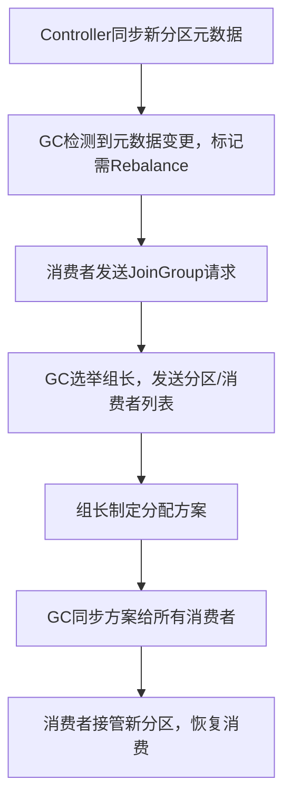

# 分区变更
你想了解Kafka在**调整主题分区数量**和**新增消费组（group）** 时，集群内部会发生的核心行为、数据流转和消费影响，我会分两个场景拆解，从「集群层面」「消费层面」「风险点」三个维度讲清楚，同时给出实操建议。

### 核心前提
先明确两个基础概念，帮助理解后续行为：
- **分区（Partition）**：Kafka主题的最小存储/消费单元，分区数决定并行度，且**仅支持增加、不支持减少**；
- **消费组（Consumer Group）**：一组消费者共同消费一个主题，Kafka通过「分区分配策略」将分区均匀分配给组内消费者，保证一个分区仅被组内一个消费者消费。

---

## 一、调整主题分区数量（仅增加）
### 1. 集群层面发生的事
#### （1）元数据变更与同步
- 执行`kafka-topics.sh --alter --topic xxx --partitions N`后，Broker的Controller节点（集群主节点）会修改该主题的元数据（分区数从旧值更新为N）；
- Controller通过ZooKeeper（Kafka < 2.8）或KRaft（Kafka ≥ 2.8）将新元数据同步给所有Broker，整个过程是**原子性的**（元数据要么全同步，要么回滚）；
- 新增分区的副本会按照「副本分配策略」（默认按Broker均匀分布）创建，新分区的初始状态为`UnderReplicated`，直到副本同步完成后变为`InSync`（ISR）。

#### （2）数据存储变化
- 新增分区是**全新的空分区**：Kafka不会自动将旧分区的数据迁移到新分区，旧数据仍保留在原有分区，只有新增的消息会按照「分区器」规则写入新分区；
- 分区器规则：默认按`key.hash() % 分区数`分配，**调整分区数后，相同key的消息可能写入不同分区**（哈希取模的分母变了）。

### 2. 消费层面发生的事
#### （1）消费组的分区重分配
- 若该主题已有消费组在消费：
  - 消费组的「协调器（GroupCoordinator）」会检测到主题元数据变更，触发**分区再平衡（Rebalance）**；
  - 再平衡过程中，组内所有消费者会暂停消费，协调器按照「分区分配策略」（如Range、RoundRobin）将新增分区分配给组内消费者；
  - 再平衡完成后，消费者恢复消费，新增分区开始被消费（从最新偏移量/重置后的偏移量开始）。

#### （2）消费偏移量（Offset）的影响
- 新增分区无历史偏移量：消费组首次消费新分区时，偏移量按`auto.offset.reset`配置（`latest`从最新消息开始，`earliest`从第一条消息开始）；
- 旧分区偏移量不受影响：原有分区的消费进度、已提交偏移量完全保留，不会因新增分区丢失。

### 3. 潜在风险与注意事项
| 风险点                | 具体影响                                                                 | 解决方案                                                                 |
|-----------------------|--------------------------------------------------------------------------|--------------------------------------------------------------------------|
| 数据分布不均          | 新增分区为空，旧分区有历史数据，短期内消费/存储负载集中在旧分区           | 若需均衡数据，可通过工具（如MirrorMaker）将旧数据迁移到新分区（非官方推荐，成本高） |
| 消息乱序              | 相同key的消息可能分散到不同分区，消费时无法保证单key的全局顺序           | 调整分区前评估是否依赖key级顺序，若需顺序，可固定key的分区映射（自定义分区器） |
| 再平衡导致消费暂停    | 分区数调整触发Rebalance，消费暂停几秒到几十秒（取决于消费组规模）         | 选择支持「增量再平衡」的客户端版本（Kafka ≥ 2.4），或在低峰期调整分区       |
| 副本同步压力          | 新增分区的副本同步会占用Broker的磁盘IO/网络带宽，可能影响集群性能         | 分批增加分区（如一次加5个，而非一次性加100个），避开业务高峰期             |

---

## 二、新增消费组（Consumer Group）
### 1. 集群层面发生的事
#### （1）消费组元数据注册
- 新消费组的第一个消费者启动后，会向Kafka的GroupCoordinator（由主题`__consumer_offsets`的分区哈希决定）注册组信息；
- Coordinator在`__consumer_offsets`主题中为该组创建「消费偏移量记录」（初始为空），记录组的基本信息（如成员数、分配策略、会话超时时间）。

#### （2）无数据迁移/副本变化
- 新增消费组仅涉及「消费层面」的元数据，**不会修改主题的分区/副本配置**，也不会触发Broker的任何数据迁移；
- 集群的存储、生产端完全不受影响（生产者仍按原有分区规则写入消息）。

### 2. 消费层面发生的事
#### （1）首次分区分配（无Rebalance）
- 新消费组的消费者启动后，Coordinator会直接执行「分区分配」：将主题的所有分区按策略分配给组内消费者（无历史分配状态，无需Rebalance）；
- 分配完成后，消费者开始拉取消息，偏移量按`auto.offset.reset`配置初始化（`latest`默认，即只消费新增消息；`earliest`会消费全量历史消息）。

#### （2）与已有消费组无冲突
- 新消费组和已有消费组是**完全隔离**的：各自维护独立的消费偏移量，即使消费同一个主题，也不会互相影响（比如A组消费到偏移量1000，B组可从0开始消费）；
- 举例：主题`order`有2个消费组`group1`（消费到偏移量500）、`group2`（新增），`group2`可从0开始消费所有历史订单消息，不影响`group1`的进度。

### 3. 潜在风险与注意事项
| 风险点                | 具体影响                                                                 | 解决方案                                                                 |
|-----------------------|--------------------------------------------------------------------------|--------------------------------------------------------------------------|
| 全量消费压垮集群      | 若新消费组配置`auto.offset.reset=earliest`，且主题数据量大，大量拉取会占用Broker IO/带宽 | 1. 先将新消费组的`auto.offset.reset`设为`latest`，启动后再通过`kafka-consumer-groups.sh`重置偏移量；2. 分批消费（如按时间范围拉取） |
| 消费者数超过分区数    | 新消费组内消费者数 > 主题分区数，多余的消费者会处于「空闲状态」（无分区可消费） | 调整消费者数 ≤ 分区数，或增加主题分区数提升并行度                         |
| 会话超时导致Rebalance | 新消费组的消费者心跳超时（默认30s），会触发Rebalance，暂停消费           | 合理配置`session.timeout.ms`（推荐6s）、`heartbeat.interval.ms`（推荐2s） |

---

## 三、两个场景的核心对比
| 操作                | 集群元数据变更 | 数据迁移 | 消费Rebalance | 偏移量影响       | 并行度变化 |
|---------------------|----------------|----------|---------------|------------------|------------|
| 增加分区数          | ✅ 主题元数据   | ❌ 无    | ✅ 触发       | 新分区无历史偏移 | ✅ 提升     |
| 新增消费组          | ✅ 消费组元数据 | ❌ 无    | ❌ 不触发     | 全量初始化       | ❌ 无       |

---

## 四、实操建议
### 1. 调整分区数的最佳实践
- 提前规划：创建主题时预估分区数（如按业务峰值TPS/单分区TPS（约1000-2000）计算），避免频繁调整；
- 低峰操作：在业务低峰期执行分区增加，减少Rebalance对消费的影响；
- 验证分配：调整后用`kafka-topics.sh --describe --topic xxx`检查分区副本分布，用`kafka-consumer-groups.sh --describe --group xxx`检查消费组分区分配。

### 2. 新增消费组的最佳实践
- 偏移量控制：默认用`latest`避免全量消费，若需消费历史数据，先通过`kafka-consumer-groups.sh --reset-offsets`指定偏移量/时间范围；
- 监控指标：新增消费组后，监控Broker的`fetch-requests`（拉取请求数）、消费者的`lag`（消费延迟），避免压垮集群；
- 分配策略：根据业务选择分区分配策略（如`RoundRobin`适合均匀分配，`Sticky`减少Rebalance的分区迁移）。

---

### 总结
1. **增加分区数**：核心是「元数据同步+消费Rebalance」，新增分区为空、旧数据不迁移，可能导致key乱序和短暂消费暂停；
2. **新增消费组**：核心是「消费组注册+首次分区分配」，与已有组隔离，风险主要在全量消费压集群；
3. **核心原则**：调整分区数需提前规划，新增消费组需控制偏移量初始化策略，均需在低峰期操作并监控核心指标。

如果需要具体的命令示例（如增加分区、重置消费组偏移量、监控消费延迟），可以告诉我，我会补充对应的实操命令。

# controller 和group coordinator

我给你用**最清晰、最直白、不绕弯**的方式讲清楚：
**Kafka Controller** 和 **GroupCoordinator** 到底是什么、干什么、区别在哪。

---

# 一句话总结
- **Controller = 集群总管（管 Broker、分区、副本、选举）**
- **GroupCoordinator = 消费组管家（管消费者、偏移量、重平衡）**

一个管**集群存储**，一个管**消费行为**，完全不打架。

---

# 1. Controller（集群控制器）
## 是什么？
- 整个 Kafka 集群**只有 1 个**Controller
- 它是从所有 Broker 里**选出来的一个**（谁先抢到谁当）
- 相当于 **Kafka 集群的“大脑/总管”**

## 它管什么？
只跟**分区、副本、Broker 故障**有关：
- 创建/删除 Topic
- 增加分区
- 副本故障 → 重新选举 Leader
- 副本同步、ISR 变化
- Broker 上下线
- 集群元数据管理

## 一句话记住
**Controller = 管 Kafka 集群存储与高可用的老大。**

---

# 2. GroupCoordinator（消费组协调器）
## 是什么？
- 每个 **消费组** 都有一个对应的 GroupCoordinator
- 它不是单独机器，而是**运行在某个 Broker 上的组件**
- 相当于 **消费组的管家**

## 它管什么？
只跟**消费者、消费组、偏移量**有关：
- 消费者加入/退出组
- 触发 **Rebalance（重平衡）**
- 管理分区分配给哪个消费者
- 接收、保存 **消费偏移量 offset**
- 管理消费者心跳

## 一句话记住
**GroupCoordinator = 管消费者怎么消费、进度到哪的管家。**

---

# 3. 最直观对比（一看就懂）
| 角色 | 数量 | 管什么 | 核心动作 |
|------|------|--------|----------|
| **Controller** | 集群只有1个 | 分区、副本、Broker、Topic | 选主、扩分区、故障恢复 |
| **GroupCoordinator** | 每个消费组1个 | 消费者、偏移量、Rebalance | 分配分区、存offset、重平衡 |

---

# 4. 它们什么时候会干活？（结合你刚才问的场景）
## ① 增加分区 → **Controller 干活**
- Controller 更新元数据
- 创建新分区
- 分配副本
- 同步到所有 Broker

## ② 消费者触发 Rebalance → **GroupCoordinator 干活**
- 通知消费者暂停
- 重新分配分区
- 告诉每个消费者该读哪些分区

## ③ 新增消费组 → **GroupCoordinator 干活**
- 给新组分配 Coordinator
- 初始化偏移量
- 分配分区给消费者

---

# 5. 超简记忆口诀
- **Controller = 管分区、管集群、管高可用**
- **GroupCoordinator = 管消费、管偏移、管重平衡**

---

如果你愿意，我可以再给你画一张**极简架构图**，一眼看懂它们在 Kafka 里的位置。

# reblance 的核心流程
你想知道Kafka增加主题分区后触发Rebalance（重平衡）的完整流程，我会拆解成「触发条件→核心步骤→关键细节」，用通俗易懂的逻辑讲清楚，同时结合你之前关注的Controller、GroupCoordinator角色，明确各环节的责任主体。

### 核心前提回顾
- 增加分区会让主题元数据变更，消费组的GroupCoordinator检测到后，会触发Rebalance；
- Rebalance的核心目的：将**新增分区**重新分配给消费组内的消费者，保证「一个分区仅被组内一个消费者消费」。

## 增加分区后Rebalance的完整流程（分7步）
为了方便理解，先定义核心角色：
- **GC**：GroupCoordinator（消费组协调器）
- **消费者**：消费组内的所有消费者实例
- **Controller**：仅负责同步分区元数据，不参与Rebalance

### 步骤1：Controller同步新分区元数据
- 你执行`kafka-topics.sh --alter`增加分区后，Controller会更新主题元数据（新分区数、副本分布），并同步给所有Broker；
- GC所在的Broker会接收到这份新元数据，知道该主题的分区数变多了。

### 步骤2：GC触发Rebalance（核心触发点）
- GC通过「元数据监听机制」发现主题分区数变更，判定当前消费组的分区分配方案已失效；
- GC主动标记该消费组为「需要Rebalance」，并等待消费者的心跳/请求来触发具体流程。

### 步骤3：消费者感知到元数据变更（可选）
- 消费者会定期（默认5分钟）拉取主题元数据，或在拉取消息时收到Broker返回的「元数据已更新」提示；
- 消费者发现分区数变多后，会停止消费，然后会向GC发送「加入消费组请求（JoinGroup）」，主动触发Rebalance。

### 步骤4：GC收集消费者信息（选举组长）
1. GC收到所有消费者的JoinGroup请求后，先等待「所有成员都完成请求」（等待时间由`rebalance.timeout.ms`控制，默认30秒）；
2. 从所有消费者中选举一个「消费组组长（Leader Consumer）」（通常是第一个发送请求的消费者）；
3. GC将**最新的主题分区列表**（包含新增分区）和「组内所有消费者列表」发送给组长。

### 步骤5：组长制定分区分配方案
- 组长根据配置的「分区分配策略」（如Range、RoundRobin、Sticky），结合「新分区列表+消费者列表」，制定新的分配方案：
  - 例：原主题有2个分区、2个消费者（每人1个），新增2个分区后，组长会分配为「每人2个分区」；
  - 分配策略决定了新增分区会分给哪些消费者（如RoundRobin会均匀分配，Range可能按序号分配）。
- 组长将分配方案发送回GC。

### 步骤6：GC同步分配方案给所有消费者
- GC接收组长的分配方案，验证合法性（如无重复分配、无遗漏分区）；
- GC将「每个消费者该消费的分区列表」单独发送给对应的消费者（通过SyncGroup请求）。

### 步骤7：消费者执行分配，恢复消费
1. 消费者接管新分配的分区（包括新增分区）：
   - 原有分区：从上次提交的偏移量继续消费；
   - 新增分区：按`auto.offset.reset`配置（latest/earliest）初始化偏移量；
2. 所有消费者恢复消费，Rebalance完成。

## 关键细节（避坑重点）
### 1. Rebalance期间的消费影响
- 整个Rebalance过程中，**消费组内所有消费者会暂停消费**，暂停时长取决于：
  - 消费组规模（消费者越多，等待JoinGroup的时间越长）；
  - 分配策略复杂度（Sticky策略比Range略慢，但能减少后续Rebalance的波动）；
  - 网络延迟（GC与消费者的通信耗时）。
- 通常小规模消费组（<10个消费者）的Rebalance耗时在1-5秒，大规模组可能达10-30秒。

### 2. 新增分区的特殊处理
- 新增分区无历史偏移量，消费者首次消费时：
  - `auto.offset.reset=latest`（默认）：从新增分区的最新消息开始消费；
  - `auto.offset.reset=earliest`：从新增分区的第一条消息（空分区则无）开始消费；
- 旧分区的偏移量完全保留，不受Rebalance影响。

### 3. 与Controller的边界
- Controller仅负责同步「分区数变更的元数据」，**不参与Rebalance的任何环节**；
- Rebalance的全流程由GC和消费者主导，Controller和GC是完全独立的组件。

### 4. 异常场景
- 若部分消费者未在`rebalance.timeout.ms`内发送JoinGroup请求，GC会将其踢出消费组，导致该消费者重新加入，触发二次Rebalance；
- 若新增分区的副本未同步完成（状态为UnderReplicated），消费者拉取该分区时会重试，直到副本变为InSync。

## 可视化流程（极简版）

## 总结
1. **核心流程**：元数据变更→GC触发Rebalance→选举组长→制定分配方案→同步方案→恢复消费；
2. **核心角色**：GC主导全流程，Controller仅同步元数据，组长负责分配方案；
3. **关键影响**：Rebalance会导致短暂消费暂停，新增分区无历史偏移量，需关注`auto.offset.reset`配置；
4. **避坑建议**：低峰期增加分区、控制消费组规模、选择Sticky分配策略，减少Rebalance的影响。

如果需要「如何减少Rebalance耗时」「如何验证Rebalance后的分区分配」的实操命令/配置，我可以补充。