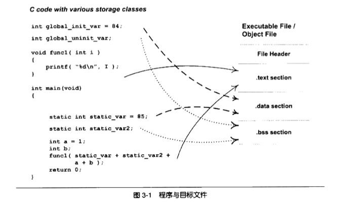
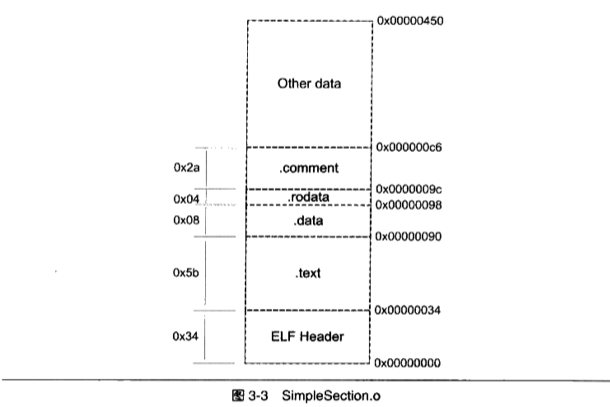
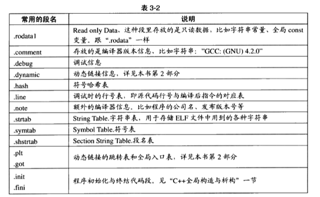

在学习链接之前，我们先看看链接的输入“目标文件Object File”里有什么。我应该可以猜到，既然链接ld的输入是多个目标文件，那么这些目标文件应该包含的信息至少有以下内容：
- 能够被其他目标文件引用的符号：变量（如全局变量等）、函数
- 尚未定义的符号：即定义在其他目标文件的变量、函数
- 每个变量/函数的地址（至少是在目标文件中的偏移量之类的能够表示位置的信息）

# 目标文件的格式
目标文件从结构上，和可执行文件的格式基本一致的，它是已经编译后的可执行文件的格式，只是还没有经过链接过程，其中可能有些符号或者有些地址还没有被调整。如果我们执行尚未链接的目标文件，操作系统会返回“文件尚未链接完成”之类的错误，这说明操作系统执行程序的模块是能够识别目标文件的。

Linux下的目标文件、可执行文件、动态链接库ddl都是按照ELF格式存储的，静态链接库（.a）稍有不同，它是将多个目标文件捆绑形成一个文件，再加上索引。我们可以通过file命令查看一个文件的格式：
```zsh
zngjiwen at n227-074-004 in ~/project/c/cbase (master)
$ file a.out
a.out: ELF 64-bit LSB shared object, x86-64, version 1 (SYSV), dynamically linked, interpreter /lib64/ld-linux-x86-64.so.2, for GNU/Linux 2.6.32, BuildID[sha1]=c047100bad48ae5d82e0e8fc3e04e31b33f89bbe, not stripped
```
可见这是一个共享（shared）目标文件。

目标文件按照数据的类型，以节section的形式存储，有时候也叫段segment。程序编译后的指令一般被存放在代码段，代码段常见的名字为.code或者.text；已初始化全局变量和局部静态变量经常被放在数据段.data；未初始化的全局变量和局部静态变量被存放在.bss段内。由于未初始化的全局变量和局部静态变量默认值都是0，因此为他们在.data段中分配空间并存放数据0是没有必要的。程序运行时他们的确是需要占用空间，并且可执行文件必须记录未初始化的全局变量和局部静态变量的大小总和（用于进程为这些变量分配空间），记为.bss段，所以.bss仅仅是为这些变量预留位置而已，它并没有内容。

<p align="center">

</p>


ELF文件的开头是一个文件头，它描述的整个文件的文件属性（是否可执行、是静态链接还是动态链接、入口地址、目标硬件、目标操作系统等），还包含一个段表，用于描述文件各个段在文件中的偏移位置及段的属性。

总的来说，代码被编译后主要被分为两种段：代码段和数据段。

面试问题：为什么指令和数据要分开存储？1. 安全：当程序被装载后，数据和指令分别被映射到两个虚拟区域，可以为不同段设置不同的读写权限，可以防止程序的指令被有意或者无意改写。2. 有利于提高程序缓存的局部性；3. 方便不同的进程共享同一个指令副本，节省内存。

## 样例
```c
// gcc -c SimpleSection.c
int printf(const char* format, ...);


int global_init_var = 84;
int global_uninit_var;

void func1(int i){
    printf("%d\n", i);
}

int main(void){
    static int static_var= 85;
    static int static_var2;
    int a =1;
    int b;
    func1(static_var+static_var2+a+b);
    return a;
}
```

我们可以通过objdump查看各段
```sh
zengjiwen at n227-074-004 in ~/project/c/programer_training/3
$ objdump -h SimpleSection.o

SimpleSection.o:     file format elf64-x86-64

Sections:
Idx Name          Size      VMA               LMA               File off  Algn
  0 .text         00000057  0000000000000000  0000000000000000  00000040  2**0
                  CONTENTS, ALLOC, LOAD, RELOC, READONLY, CODE
  1 .data         00000008  0000000000000000  0000000000000000  00000098  2**2
                  CONTENTS, ALLOC, LOAD, DATA
  2 .bss          00000004  0000000000000000  0000000000000000  000000a0  2**2
                  ALLOC
  3 .rodata       00000004  0000000000000000  0000000000000000  000000a0  2**0
                  CONTENTS, ALLOC, LOAD, READONLY, DATA
  4 .comment      0000002e  0000000000000000  0000000000000000  000000a4  2**0
                  CONTENTS, READONLY
  5 .note.GNU-stack 00000000  0000000000000000  0000000000000000  000000d2  2**0
                  CONTENTS, READONLY
  6 .eh_frame     00000058  0000000000000000  0000000000000000  000000d8  2**3
                  CONTENTS, ALLOC, LOAD, RELOC, READONLY, DATA
```

除了基本的代码、数据、bss外，还有三个段，分别是只读数据段.rodata、注释信息段.comment和堆栈提示段.note.GNU-stack。
- size表示段的长度；file offset为段在文件中的位置。
- CONTENTS 表示该段在文件中存在（可见bss没有CONTENTS）

<p align="center">

</p>

我们也可以通过size命令查看各段的大小：
```sh
zengjiwen at n227-074-004 in ~/project/c/programer_training/3
$ size SimpleSection.o
   text    data     bss     dec     hex filename
    179       8       4     191      bf SimpleSection.o
```

## 数据段和只读数据段
- .data保存的是初始化了的全局静态变量和局部静态变量（global_init_varabal, static_var），一共8字节
- 字符串常量“%d\n”是一种只读数据，它被放在.rodata段，一个四个字节，即25640a00（以\0结尾）。（有时候编译器会将字符串常量放在data段）
- .data的前四个字节，是54000000，这个值刚好是global_init_var（84）的大端表示。55000000即是static_var。
- 
```sh
zengjiwen at n227-074-004 in ~/project/c/programer_training/3
$ objdump -x -d -s SimpleSection.o|less
  ...
Contents of section .data:
 0000 54000000 55000000                    T...U...
Contents of section .rodata:
 0000 25640a00                             %d..
Contents of section .comment:
 0000 00474343 3a202844 65626961 6e20362e  .GCC: (Debian 6.
 0010 332e302d 31382b64 65623975 31292036  3.0-18+deb9u1) 6
 0020 2e332e30 20323031 37303531 3600      .3.0 20170516.
  ...
```

## bss
.bss段存储的是未初始化的全局变量和局部静态变量，更准确的说，是存储了这些变量的大小总和。但是我们通过“objdump -h” 命令看到，.bss的size是4，但是我们的样例代码的global_uninit_var、static_var2一共应该占用8个字节。这是因为，有些编译器会讲全局的未初始化变量存放在.bss，有些则不存放，只是预留一个未定义的全局变量符号，等到最终链接的时候再在.bss分配空间。（后文的强/弱符号会有更详细的描述）

## 其他段
除了上述常见的段外，还有部分段objdump没有列出来。

<p align="center">

</p>


我们可以指定代码存放在特定的段中，以便实现某些功能，比如linux内核中用来完成一些初始化和用户空间复制时出现页错误异常等。gcc提供了一个扩展机制，可以指定变量所在的段：
```c
__attribute__((section("FOO"))) int global = 42;
__attribute__((section("BAR"))) void foo(){};
```

# ELF 文件结构

