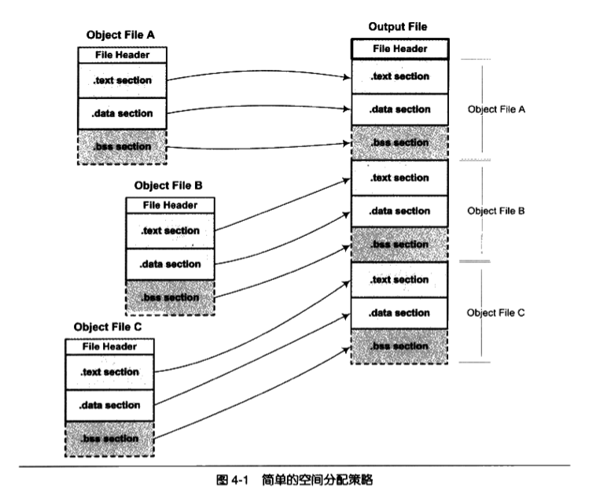
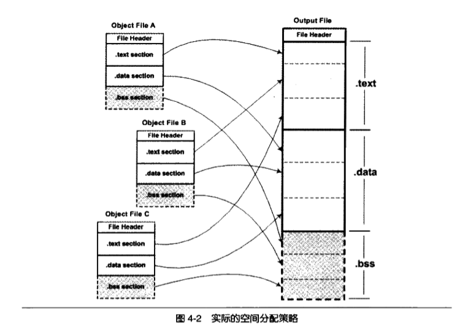
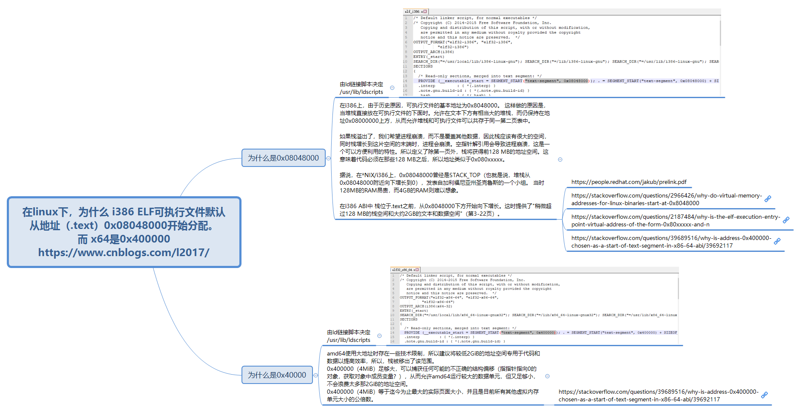

上一文我们学习了目标文件（ELF）的结构：段表、.text、.data、.symtab等知识，接下来的问题是，当我们有两个目标文件，如何将它们链接起来形成一个可执行文件？这个过程发生了什么？这就是链接的核心内容。接下来我们将使用以下代码进行分析：
```c
// b.c
int shared = 1;
void swap(int *a, int *b)
{
	*a ^= *b ^= *a ^= *b;
}


// a.c
extern int shared;

int main()
{
	int a = 100;
	swap(&a, &shared);
}
```
- 当我们运行“gcc -c a.c b.c”，会生成两个目标文件a.o、b.o（编译a.c会有warning：implicit declaration of function ‘swap’ [-Wimplicit-function-declaration]）
- b.c定义一个全局变量shared，以及函数swap
- a.c定义了一个全局符号main，并应用了其他文件的shared、swap
我们的目标就是分析链接器是如何将a.o和b.o链接起来，产生一个可执行文件。

# 空间和地址分配
我们知道可执行文件的代码段和数据段和事由输入的目标文件合并何来的，那链接器是如何将它们的各个段合并到输出文件？或者说，输出文件的空间是如何分配给输入文件？

## 按序叠加
一个最简单的方案就是贱给输入的目标文件按照次序叠加起来：
<p align="center">

</p>

上图将各个目标文件依次合并。但这样做会有很多问题：当输入文件较多的情况下，输出文件会有很多零散的段。比如实际工作的应用程序中会有数百个目标文件，如果每个目标文件都分别有.text、.data、.bss等段，那么最后的输出文件将有成百上千的零散的段。而且这种方式很浪费空间，因为每个段都需要有一定的地址和空间对齐要求，比如对于x86的硬件来说，段的装载地址和空间的对齐单位是页，也就是4k字节。那么如果一个段的长度只有一个字节，它在内存中占用4096字节，会造成内存空间中大量的内存碎片。

## 相似段合并
一个更实际的方法是将相似性质的段合并在一起，如将所有输入文件的.text合并到输出文件.text段：
<p align="center">

</p>

上图将目标文件的代码、数据、bss段分别合并到输出文件的代码、数据、bss段。.bss段在目标文件和可执行文件并不占用空间，它仅仅是在装载时占用地址空间。所以链接器在合并各段的时候，也将.bss合并，并且分配虚拟空间，但并不分配文件空间（.bss段仅仅用来标记全局变量一共占用了多少虚拟空间，值都是0，因此无需占用文件空间）。.text, .data等段，在文件和虚拟地址中都需要分配空间，因为它们在两者中都存在。

实际上，链接器也的确是按这种方式进行链接的。使用这种方法的链接器一般都采用一种叫两步链接的方法：
- 第一步：空间和地址分配，扫描所有输入的目标文件，获取它们各个段的长度、属性、位置，并且将输入目标文件中的符号定义、符号引用收集起来，统一放到一个全局符号表，将各个段合并起来
- 第二部：符号解析和重定位。基于上一步，读取输入文件的段的数据、重定位信息，并且进行符号解析和重定位、调整代码中的地址等

```c
$ ld a.o b.o -e main -e ab

$ ./ab
[1]    3905520 segmentation fault (core dumped)  ./ab

```
- -e main：将main函数作为程序入口，ld链接器默认的程序入口时_start
- -o ab：表示输出文件名为ab，默认为a.out
- 运行ab，发生错误：egmentation fault，我们后续再分析这个问题

现在我们看下链接前后的地址分配情况：
```c
$ objdump -h a.o
b.o:     file format elf64-x86-64

Sections:
Idx Name          Size      VMA               LMA               File off  Algn
  0 .text         0000002e  0000000000000000  0000000000000000  00000040  2**0
                  CONTENTS, ALLOC, LOAD, RELOC, READONLY, CODE
  1 .data         00000000  0000000000000000  0000000000000000  0000006e  2**0
                  CONTENTS, ALLOC, LOAD, DATA
  2 .bss          00000000  0000000000000000  0000000000000000  0000006e  2**0
                  ALLOC
  ...

$ objdump -h b.o

Sections:
Idx Name          Size      VMA               LMA               File off  Algn
  0 .text         0000004b  0000000000000000  0000000000000000  00000040  2**0
                  CONTENTS, ALLOC, LOAD, READONLY, CODE
  1 .data         00000004  0000000000000000  0000000000000000  0000008c  2**2
                  CONTENTS, ALLOC, LOAD, DATA
  2 .bss          00000000  0000000000000000  0000000000000000  00000090  2**0
                  ALLOC
  ...


$ objdump -h ab
Sections:
Idx Name          Size      VMA               LMA               File off  Algn
  0 .text         00000079  00000000004000e8  00000000004000e8  000000e8  2**0
                  CONTENTS, ALLOC, LOAD, READONLY, CODE
  1 .eh_frame     00000058  0000000000400168  0000000000400168  00000168  2**3
                  CONTENTS, ALLOC, LOAD, READONLY, DATA
  2 .data         00000004  0000000000601000  0000000000601000  00001000  2**2
                  CONTENTS, ALLOC, LOAD, DATA
  3 .comment      0000002d  0000000000000000  0000000000000000  00001004  2**0
                  CONTENTS, READONLY
```
- VMA: Virtual Memory Address，即虚拟地址。LMA表示Load Memory Address，即加载地址。一般情况下，这两个值时相同的，但在某些嵌入式系统中，特别是程序放在ROM的系统中是，二者是不同的。我们只关注VMA。

链接前后的程序所使用的地址已经是程序在进程中的虚拟地址，即我们关心上面各个段中的VMA和size，而忽略文件偏移。可以看到，链接之前，目标文件的VMA都是0，这是因为虚拟空间还没有被分配，所以默认都是0。等链接结束后，ab中的各个段都被分配了相应的虚拟地址（我的系统是x86-64）：
- .text 被分配到了0x004000e8，大小为0x79字节（如果你的x86系统，那么.text地址应该是0x08048094）
- .data 被分配到了0x00601000，大小为4个字节（如果你的x86系统，那么.data地址应该是0x08049108）

我们可以看到a.o和b.o的代码段先后叠加起来，合并称ab的一个.text段（0x2e+ox4b=0x79），所以ab的代码段肯定包含了main函数和swap函数的代码。

为什么.text和.data的地址不是从虚拟空间的0地址开始分配呢？这设计到操作系统进程虚拟地址空间的分配规则，在Linux下，x86-ELF可执行文件默认从地址0x0804800开始分配，x86-64是从0x00400000开始分配：

<p align="center">

</p>

## 符号地址的确定
在第一步的扫描和空间分配中，我们已经确定了.text的起始地址为0x004000e8，.data的起始地址为0x00601000（我们仍旧是x86为例）。那么这一步完成后，链接器开始计算各个符号的虚拟地址。因为各个符号在段内的相对地址是固定的，所以这时候main、shared、swap的地址也已经是确定的了，只不过链接器须给每个符号加上一个偏移量，使它们能够调整到正确的虚拟地址。从前面的objdump的输出看出，main位于a.o的.text的最开始，也就是偏移量为0，所有main在最终的输出文件的地址应该就是0x004000e8+0，即0x004000e8。同样，我们可以通过一样的计算方法的值所有符号的地址：main的长度为0x2e(即46)字节，而我们的代码只有两个函数，可以猜到swap应该就在main之后，0x004000e8+0x2e=0x00400116，刚好是swap的虚拟地址。
```c
$ readelf -s ab

Symbol table '.symtab' contains 13 entries:
   Num:    Value          Size Type    Bind   Vis      Ndx Name
   ...
     7: 0000000000400116    75 FUNC    GLOBAL DEFAULT    1 swap
     8: 0000000000601000     4 OBJECT  GLOBAL DEFAULT    3 shared
     9: 0000000000601004     0 NOTYPE  GLOBAL DEFAULT    3 __bss_start
    10: 00000000004000e8    46 FUNC    GLOBAL DEFAULT    1 main
    11: 0000000000601004     0 NOTYPE  GLOBAL DEFAULT    3 _edata
    12: 0000000000601008     0 NOTYPE  GLOBAL DEFAULT    3 _end
```

# 符号解析和重定位
在完成空间和地址的分配步骤后，链接器就进入了符号解析和重定位的步骤，也就是静态链接的核心内容。在分析符号解析和重定位之前，我们先看看编译器在讲a.c编译称指令时，它如何访问shared变量？如何调用swap函数？我们可以反编译看看a.o的代码：
```c
$ objdump -d a.o

a.o:     file format elf64-x86-64


Disassembly of section .text:

0000000000000000 <main>:
   0:   55                      push   %rbp
   1:   48 89 e5                mov    %rsp,%rbp
   4:   48 83 ec 10             sub    $0x10,%rsp
   8:   c7 45 fc 64 00 00 00    movl   $0x64,-0x4(%rbp)
   f:   48 8d 45 fc             lea    -0x4(%rbp),%rax
  13:   48 8d 35 00 00 00 00    lea    0x0(%rip),%rsi        # 1a <main+0x1a>
  1a:   48 89 c7                mov    %rax,%rdi
  1d:   b8 00 00 00 00          mov    $0x0,%eax
  22:   e8 00 00 00 00          callq  27 <main+0x27>
  27:   b8 00 00 00 00          mov    $0x0,%eax
  2c:   c9                      leaveq
  2d:   c3                      retq
```
- 我们可以看到main的其实地址是0x0000000，因为在未进行空间分配之前，目标文件代码是从0x00000000开始的。
  

我们可以看到在第偏移位13的lea指令(48 8d 35 00 00 00 00)中，这个指令共八个字节，他的作用是将shared的地址复制到rsi寄存器中，前面四个字节是指令码，后面四个字节是shared的地址。当a.c被编译的时候，编译器并不知道shared、swap的地址，因为它们定义在其他目标文件中，所以编译器暂时把地址0作为share的地址，因此在lea指令中,shared的地址位0x00000000，这个地址将在重定位过程中，被修正为正确的地址。

我们再看偏移量为22的指令（e8 00 00 00 00），可见swap的地址也是0x0000000。e8是一条近相对位移调用指令，后面四个字节是被调用函数的相对于调用指令的下一跳指令的偏移量。偏移为0x0000000，即偏移为零，所以callq指令的实际调用地址为0x27。但是我们可以看到0x27存放着的并不是swap的地址。跟shared的地址一样，这也是一个临时的假地址。在链接后，swap将被修正为一个正确相对值（即相对地址）。（在x86中，函数调用指令一般被编译为e8 fc ff ff ff）。

编译器把这两条指令的地址部分暂时用0x00000000代替，把真正的地址计算工作留给了链接器。从上一节我们知道，链接器在完成地址和空间分配之后，就已经确定所有符号的虚拟地址了，那么链接器就能够根据符号的地址，对每个需要重定位的指令进行地址修正。我们通过objdump反汇编程序ab的代码段，可以看到main函数中的两个重定位入口都已经被修成成正确的地址了：

```c
$ objdump -d ab

ab:     file format elf64-x86-64


Disassembly of section .text:

00000000004000e8 <main>:
  4000e8:       55                      push   %rbp
  4000e9:       48 89 e5                mov    %rsp,%rbp
  4000ec:       48 83 ec 10             sub    $0x10,%rsp
  4000f0:       c7 45 fc 64 00 00 00    movl   $0x64,-0x4(%rbp)
  4000f7:       48 8d 45 fc             lea    -0x4(%rbp),%rax
  4000fb:       48 8d 35 fe 0e 20 00    lea    0x200efe(%rip),%rsi        # 601000 <shared>
  400102:       48 89 c7                mov    %rax,%rdi
  400105:       b8 00 00 00 00          mov    $0x0,%eax
  40010a:       e8 07 00 00 00          callq  400116 <swap>
  40010f:       b8 00 00 00 00          mov    $0x0,%eax
  400114:       c9                      leaveq
  400115:       c3                      retq

0000000000400116 <swap>:
  400116:       55                      push   %rbp
  ...
```

我们可以看到指令中swap的地址被替换成了0x00000007（指令中是小端表示），下一条指令地址是0x0040010f，0x0040010f + 0x00000007 = 0x00400116，刚好是swap的虚拟地址（和上一节的“readelf -s ab”的输出结果符合）。同理，0x00400102 + 0x00200efe = 0x00601000，也就是shared的虚拟地址。

## 重定位表
现在我们链接器已经知道每个符号的地址了，那它怎么知道哪些指令时需要被调整的呢？这些指令哪些部分需要被调整呢？怎么调整？事实上，在ELF文件中，有一个叫重定位表的结构，准备存储了这些与重定位相关的信息。对于可重定位的ELF文件中，它必须包含重定位表，用来描述如何修改相应的段里的内容。一个重定位表往往就是ELF文件中的一个段。比如代码段.text如有需要被重定位的地方，那么会有一个相应的叫.rel.text的段保存代码段的重定位表。相应的，如果.data需要被重定位，那也有一个.rel.data段保存了数据段的重定位表。

```c
$ readelf -S a.o
There are 12 section headers, starting at offset 0x2d0:

Section Headers:
    ...
  [Nr] Name              Type             Address           Offset
       Size              EntSize          Flags  Link  Info  Align
  [ 1] .text             PROGBITS         0000000000000000  00000040
       000000000000002e  0000000000000000  AX       0     0     1
  [ 2] .rela.text        RELA             0000000000000000  00000228
       0000000000000030  0000000000000018   I       9     1     8
  [ 3] .data             PROGBITS         0000000000000000  0000006e
       0000000000000000  0000000000000000  WA       0     0     1
    ...
```

每个需要被重定位的地方叫一个重定位入口。我们知道看到a.o的.text段里面有两个重定位入口，相对应的，.rela.text保存了代码段的重定位表。我们再看看a.o的重定位表里有什么信息：
```c
$ objdump -r a.o

a.o:     file format elf64-x86-64

RELOCATION RECORDS FOR [.text]:
OFFSET           TYPE              VALUE
0000000000000016 R_X86_64_PC32     shared-0x0000000000000004
0000000000000023 R_X86_64_PLT32    swap-0x0000000000000004


RELOCATION RECORDS FOR [.eh_frame]:
OFFSET           TYPE              VALUE
0000000000000020 R_X86_64_PC32     .text
```

可见，.text中，有两个需要重定位的地方，分别对应shared、swap两个符号；TYPE表示要如何修改这些位置的指令；OFFSET表示需要被调整的位置，这两个符号它们在代码段中的位移分别是0x16和0x23，和前文中a.o的反编译结果刚好吻合。
```c
$ objdump -d a.o
  ...
  13:   48 8d 35 00 00 00 00    lea    0x0(%rip),%rsi        # 1a <main+0x1a>
  1a:   48 89 c7                mov    %rax,%rdi
  1d:   b8 00 00 00 00          mov    $0x0,%eax
  22:   e8 00 00 00 00          callq  27 <main+0x27>
  ...
```
综合，所谓的重定位表，就是描述重定位入口的数组，数组的每个元素描述了：
- 需要被重定位的位置
- 这个位置对应的是什么符号的地址
- 这个位置中的修改方式是什么，比如相对寻址还是绝对寻址

## 符号解析
重定位的过程中，每个重定位入口都是对一个符号的引用，那么当链接器须要对某个符号的引用进行重定位的时候，它就好确定这个符号的目标地址。这个时候链接器就会去查找由所有输入目标文件的符号表组成的全局符号表，找到相应的符号后进行重定位。

比如a.o中，shared和swap都是undefined类型，所有对引用这两个符号的地方，都需要相应的进行重定位。
```
$ readelf -s a.o

Symbol table '.symtab' contains 12 entries:
   Num:    Value          Size Type    Bind   Vis      Ndx Name
     0: 0000000000000000     0 NOTYPE  LOCAL  DEFAULT  UND
     1: 0000000000000000     0 FILE    LOCAL  DEFAULT  ABS a.c
     2: 0000000000000000     0 SECTION LOCAL  DEFAULT    1
     3: 0000000000000000     0 SECTION LOCAL  DEFAULT    3
     4: 0000000000000000     0 SECTION LOCAL  DEFAULT    4
     5: 0000000000000000     0 SECTION LOCAL  DEFAULT    6
     6: 0000000000000000     0 SECTION LOCAL  DEFAULT    7
     7: 0000000000000000     0 SECTION LOCAL  DEFAULT    5
     8: 0000000000000000    46 FUNC    GLOBAL DEFAULT    1 main
     9: 0000000000000000     0 NOTYPE  GLOBAL DEFAULT  UND shared
    10: 0000000000000000     0 NOTYPE  GLOBAL DEFAULT  UND _GLOBAL_OFFSET_TABLE_
    11: 0000000000000000     0 NOTYPE  GLOBAL DEFAULT  UND swap
```

## 指令修改方式
不同处理器指令对于地址的格式和方式都是不一样的，不同指令的寻址方式页千差万别：有近址和远址寻址，有绝对和相对寻址，寻址长度有8、16、32、64位等等。

前文a.o代码中的重定位入口刚好只用到了两种寻址方式R_X86_64_PC32和R_X86_64_PLT32，且都是相对寻址，寻址长度都是32位。因此，对应的位置都被修改成符号地址相对于下一条指令的偏移量。


# COMMON块
