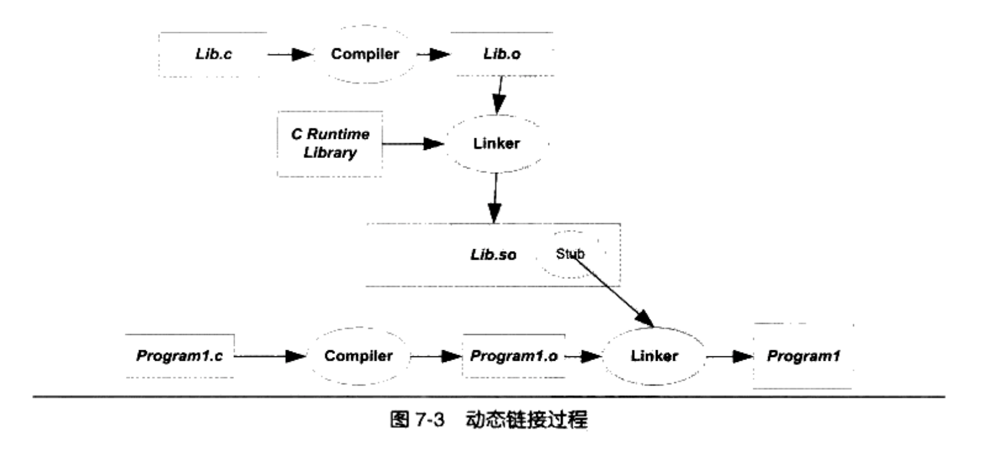
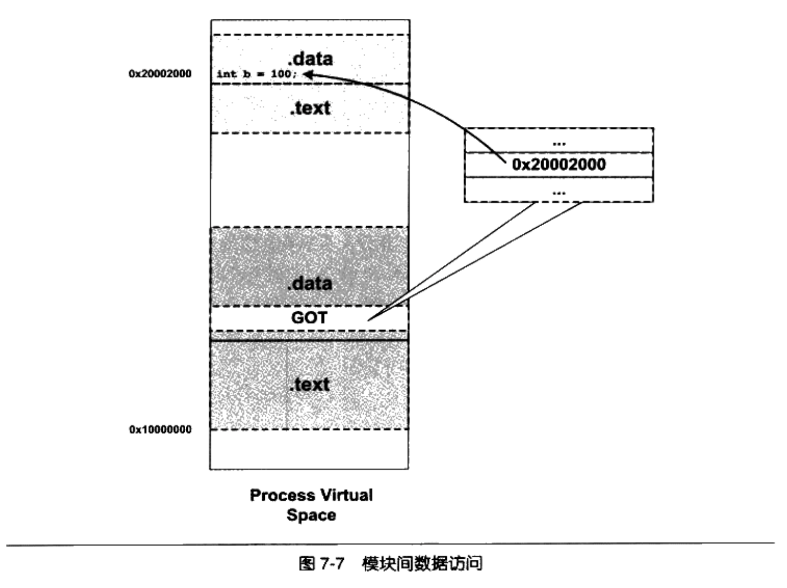
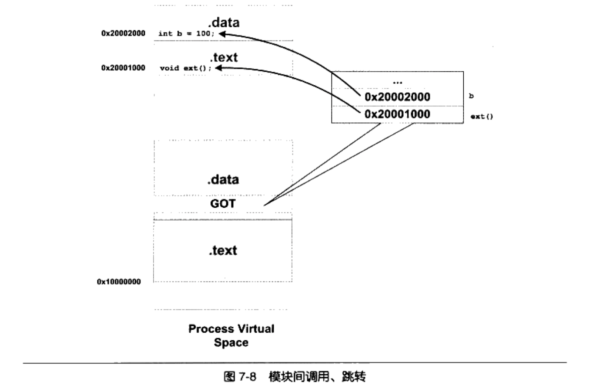

前文讲了静态链接和装载，我们这一次来聊聊动态链接。

# 为什么要动态链接
在前文中，我们已经知道，静态链接会有浪费内存和磁盘空间、模块更新困难等问题：
- 不同程序如果依赖统一个模块，那该模块在内存中将会存在多个的副本
- 程序依赖的模块很多时候是由第三方厂商开发的，当该模块更新，整个程序就需要重新连接才能使用新版本的模块

为此，一个很自然的想法，就是将对该模块的连接过程推迟到运行时进行，这就是动态链接的基本思想。动态链接还有一个特点，就是程序在运行时可以动态地夹在各种程序模块，这个优点就是后来被人们用来制作程序的插件。

动态链接涉及运行时的链接及多个文件的装载，必须要有操作系统的支持，因为动态链接的情况下，进程的虚拟地址空间的分布会比静态链接情况下更为复杂，还有一些存储管理、内存共享、进程线程等机制在动态链接下也会有一些微妙的变化。

在liunx下，常用的C语言库的运行库glibc，它的动态链接形式的版本保存在“/lib”目录下，文件名叫做“libc.so”。当程序被装载的时候，系统的动态链接器会将程序所需要的所有动态链接库装载到进程的地址空间中，并且将程序中所有未决议的符号绑定到相应的的动态链接库中，并进行重定位工作。

程序与libc.so的链接工作是由动态链接器完成的，而不是由我们前面看到的静态链接器ld完成的。动态链接会导致程序在性能上有一些损失，但是对动态链接的过程可以优化，比如我们后续将介绍的延迟绑定等方法，可以使得动态链接的性能损失尽可能地小。

# 动态链接例子
```c
/* Program1.c */
#include "Lib.h"

int main()
{
    foobar(1);
    return 0;
}

/* Lib.H */
#ifdef LIB_H
#define LIB_H
void foobar(int i);
#endif

/* Lib.c */
#include <stdio.h>
void foobar(int i)
{
    printf("Printing from Lib.so %d\n", i);
}
```

程序很简单。我们将Lib.c编译成共享文件：
```sh
# shared 表示生成共享对象
# fPIC表示地址无关，后续会介绍
$ gcc -fPIC -shared -o Lib.so Lib.c
```

接下来我们编译主程序
```sh
# ./Lib.so 表示程序依赖该动态链接库，当装载主程序的时候，会自动链接该模块
$ gcc -o Program1 Program1.c ./Lib.so

$ readelf -s Program1 
# output，可见foobar是undefined
    # ...
    # 52: 0000000000000000     0 FUNC    GLOBAL DEFAULT  UND foobar
    # ...

$ readelf -s Lib.so
# output，可见printf也是undefined
    # ...
    # 49: 0000000000000000     0 FUNC    GLOBAL DEFAULT  UND printf@@GLIBC_2.2.5
    # ...
```
整个链接过程如下图所示：
<p align="center">

</p>

当链接器将Program.o链接成可执行文件时，这个时候链接器必须确定Program1.o中所应用的foobar函数的地址。如果foobar是一个定义在其他静态目标模块中的函数，那么连接器将会按照静态链接的规则，将Program.o中的foobar地址引用重定位；如果foobar时一个定义在某个动态共享对象中的函数（foobar这个符号存在于Lib.so中），那么链接器就会将这个符号的引用标记为一个动态链接符号，不对它进行地址重定位，把这个过程留到装载时再进行。

我们可以在Lib.c中加入sleep函数，然后运行Program1，观察进程的地址空间分布：
```c
/* Lib.c */
#include <stdio.h>
void foobar(int i)
{
    printf("Printing from Lib.so %d\n", i);
    sleep(-1);
}
```

```sh
$ ./Program1 &
$ cat /proc/3456572/maps
55d6de0b8000-55d6de0b9000 r-xp 00000000 08:10 3021936                    /data00/home/zengjiwen/project/c/programer_training/7/Program1
55d6de2b8000-55d6de2b9000 r--p 00000000 08:10 3021936                    /data00/home/zengjiwen/project/c/programer_training/7/Program1
55d6de2b9000-55d6de2ba000 rw-p 00001000 08:10 3021936                    /data00/home/zengjiwen/project/c/programer_training/7/Program1
55d6df132000-55d6df153000 rw-p 00000000 00:00 0                          [heap]
7f0a50c2c000-7f0a50dc1000 r-xp 00000000 08:01 1552                       /lib/x86_64-linux-gnu/libc-2.24.so
7f0a50dc1000-7f0a50fc1000 ---p 00195000 08:01 1552                       /lib/x86_64-linux-gnu/libc-2.24.so
7f0a50fc1000-7f0a50fc5000 r--p 00195000 08:01 1552                       /lib/x86_64-linux-gnu/libc-2.24.so
7f0a50fc5000-7f0a50fc7000 rw-p 00199000 08:01 1552                       /lib/x86_64-linux-gnu/libc-2.24.so
7f0a50fc7000-7f0a50fcb000 rw-p 00000000 00:00 0
7f0a50fcb000-7f0a50fcc000 r-xp 00000000 08:10 3021935                    /data00/home/zengjiwen/project/c/programer_training/7/Lib.so
7f0a50fcc000-7f0a511cb000 ---p 00001000 08:10 3021935                    /data00/home/zengjiwen/project/c/programer_training/7/Lib.so
7f0a511cb000-7f0a511cc000 r--p 00000000 08:10 3021935                    /data00/home/zengjiwen/project/c/programer_training/7/Lib.so
7f0a511cc000-7f0a511cd000 rw-p 00001000 08:10 3021935                    /data00/home/zengjiwen/project/c/programer_training/7/Lib.so
7f0a511cd000-7f0a511f0000 r-xp 00000000 08:01 1544                       /lib/x86_64-linux-gnu/ld-2.24.so
7f0a513dd000-7f0a513df000 rw-p 00000000 00:00 0
7f0a513ee000-7f0a513f0000 rw-p 00000000 00:00 0
7f0a513f0000-7f0a513f1000 r--p 00023000 08:01 1544                       /lib/x86_64-linux-gnu/ld-2.24.so
7f0a513f1000-7f0a513f2000 rw-p 00024000 08:01 1544                       /lib/x86_64-linux-gnu/ld-2.24.so
7f0a513f2000-7f0a513f3000 rw-p 00000000 00:00 0
7ffc65bae000-7ffc65bcf000 rw-p 00000000 00:00 0                          [stack]
7ffc65be5000-7ffc65be8000 r--p 00000000 00:00 0                          [vvar]
7ffc65be8000-7ffc65bea000 r-xp 00000000 00:00 0                          [vdso]
```
可见，整个进程虚拟地址空间中，多出了几个文件的映射。Lib.so和Program1一样，被操作系统用同样的方法映射到进程的虚拟空间，只是它们占据的虚拟地址和长度不同。除此以外，libc也以动态链接库的形式，被链接了起来，libc.so的具体目录是“/lib/x86_64-linux-gnu/libc-2.24.so”。我们可以通过一下命令查看Lib.so的装载属性:

```sh
$ readelf -l Lib.so

Elf file type is DYN (Shared object file)
Entry point 0x5c0
There are 7 program headers, starting at offset 64

Program Headers:
  Type           Offset             VirtAddr           PhysAddr
                 FileSiz            MemSiz              Flags  Align
  LOAD           0x0000000000000000 0x0000000000000000 0x0000000000000000
                 0x00000000000007bc 0x00000000000007bc  R E    0x200000
  LOAD           0x0000000000000e00 0x0000000000200e00 0x0000000000200e00
                 0x0000000000000230 0x0000000000000238  RW     0x200000
  DYNAMIC        0x0000000000000e18 0x0000000000200e18 0x0000000000200e18
                 0x00000000000001c0 0x00000000000001c0  RW     0x8
  NOTE           0x00000000000001c8 0x00000000000001c8 0x00000000000001c8
                 0x0000000000000024 0x0000000000000024  R      0x4
  GNU_EH_FRAME   0x0000000000000718 0x0000000000000718 0x0000000000000718
                 0x0000000000000024 0x0000000000000024  R      0x4
  GNU_STACK      0x0000000000000000 0x0000000000000000 0x0000000000000000
                 0x0000000000000000 0x0000000000000000  RW     0x10
  GNU_RELRO      0x0000000000000e00 0x0000000000200e00 0x0000000000200e00
                 0x0000000000000200 0x0000000000000200  R      0x1

 Section to Segment mapping:
  Segment Sections...
   00     .note.gnu.build-id .gnu.hash .dynsym .dynstr .gnu.version .gnu.version_r .rela.dyn .rela.plt .init .plt .plt.got .text .fini .rodata .eh_frame_hdr .eh_frame
   01     .init_array .fini_array .jcr .dynamic .got .got.plt .data .bss
   02     .dynamic
   03     .note.gnu.build-id
   04     .eh_frame_hdr
   05
   06     .init_array .fini_array .jcr .dynamic .got
```
除了文件类型和普通程序不同外，其他几乎一样。还有一点不同：动态链接模块的装载地址是从地址0x00000000开始，因为在装载之前，我们是不知道该模块的虚拟地址的的。共享对象的最终装载地址在编译时是不确定的，而是在装载时，装载起根据当前地址空间的空闲情况，动态分配一块足够大小的虚拟地址空间给相应的共享对象。

# 地址无关代码
## 固定装载地址的困扰
我们先来假设下：动态链接库的代码段，如果对数据（动态库内、外的数据）的引用使用绝对地址，那么这会导致代码无法使用，因为程序运行时，库的装载地址是未知的。同时，升级共享库必须保持共享库中全局函数和变量的地址保持不表。如果应用程序在链接时已经绑定了这些地址，一旦变更，就必须重新链接应用程序，否则会引起应用程序的崩溃。

因此。共享对象在编译时不能假设自己在进程虚拟地址空间中的未知。

## 装载时重定位
一旦模块装载地址确定了，即目标地址确定，那么系统就对程序中所有的绝对地址引用进行重定位。假设前文的函数foobar相对于代码段的起始时0x100，当模块被装载到0x10000000，我们假设代码段位于模块的最开始，那么foobar的地址就是0x10000100。这时候，系统便利模块中的重定位表，把所有foobar的地址引用都重定位只0x10000100.（实际情况类似，但是不一样）

这种重定位我们称之为装载时重定位，与链接时重定位相对应。Linux和GCC支持这种装载时重定位的方法，我们前面产生共享对象时，使用了两个GCC参数“-shared”和“-fPIC”，如果只使用“shared”，那么输出的共享对象就是使用装载时重定位的方法。

## 地址无关代码
装载时重定位时解决动态模块中有绝对地址引用的方法之一，但是它有一个很大的缺点是指定指令无法在进程之间共享（因为装载时代码段中的地址引用就和具体的进程绑定了，其他进程无法使用），这样就失去了动态链接节省内存的一大优势。解决这个问题的基本想法就是把指令中哪些需要被修改的部分分离出来，跟数据部分放在一起，这样指令部分就可以保持不变，而数据部分可以在每个进程中拥有一个副本。这种方案就是目前被称为地址无关代码（PIC）。

我们把共享独享模块中的地址引用分为四类：
- 模块内部的函数调用、跳转等
- 模块内部的数据访问，比如模块定义的全局变量、静态变量
- 模块外部的函数调用、跳转
- 模块外部的数据访问，比如其他模块中定义的全局变量

```c
/* pic.c */
static int a;

// b和ext可能定义在模块内部，也可能是外部
// 因此编译器只能将它们当作模块外的函数和变量来处理
extern int b;
extern void ext();

void bar()
{
    a = 1;
    b = 2;
}
void foo()
{
    bar();
    ext();
}
```

### 模块内部调用或跳转
这种情况比较简单。对于现代系统来将，模块内部的跳转、函数调用都可以是相对地址调用，或者基于寄存器的相对调用，所以对于这种指令是不需要重定位的。基本逻辑同静态链接-相对地址跳转。

但是实际上，这种方式还有一定的问题，这里存在一个叫做共享对象全局符号接入的问题，这个问题在“动态链接的实现”中还会详细介绍。

### 模块内部数据访问
我们知道，一个模块前面一般是若干页的代码，后面紧跟若干页的数据，这些页之间的顺序是固定，也就是说，任何一条指令和它所需要访问的模块内部数据之间的相对地址是固定，那么只需要相对于当前指令加上固定的偏移量就可以访问模块内部的数据了。

<!-- 但是现代体系结构中，数据相对寻址往往没有相对于当前指令地址（PC）的寻址方式（基于下一条指令），所以ELF用了一个很巧妙的方法来得到当前指令的PC值。 -->

```sh
$ gcc -fPIC -shared -o pic.so pic.c
$ objdump -d pic.so

00000000000006f0 <bar>:
 6f0:   55                      push   %rbp
 6f1:   48 89 e5                mov    %rsp,%rbp
 6f4:   c7 05 36 09 20 00 01    movl   $0x1,0x200936(%rip)        # 201034 <a>
 6fb:   00 00 00
 6fe:   48 8b 05 d3 08 20 00    mov    0x2008d3(%rip),%rax        # 200fd8 <b>
 705:   c7 00 02 00 00 00       movl   $0x2,(%rax)
 70b:   90                      nop
 70c:   5d                      pop    %rbp
 70d:   c3                      retq

$ realelf -s pic.so

 35: 0000000000201034     4 OBJECT  LOCAL  DEFAULT   23 a
```
我们可以看到0x6fe+0x200936刚好等于0x00201034。加入模块被装载到0x10000000这个地址，那么a的实际地址就是0x10000000+0x6fe+0x200936。

### 模块间数据访问
前面例子中的变量b，编译器会将其认为是定义在其他模块中的变量，并且该地址在装载时才能确定。很明显，这些其他模块的全局变量的地址是跟其他模块装载地址相关的。ELF的做法是在数据段里建立一个指向这些变量的指针数组，也称为全局偏移表（Global Offset Table，GOT），当代码段需要引用该全局变量时，可以通过GOT中相对的项间接引用，基本机制如下：

<p align="center">

</p>

当指令要访问变量b时，程序会先找到GOT，然后根据GOT中变量所对应的项找到变量的目标地址。（32机器中）每个变量都对应一个4字节的地址，链接器在装载模块时会查找没给变量所在的地址，然后填充GOT中的各个项，以确保每个指针锁指向的地址正确。由于GOT本身时存储在数据段中的，所以它可以在模块装载时被修改，并且每个进程都可以有独立的副本，相互不受影响。

模块在编译时可以确定模块内部变量相对于当前指令的偏移量，那么我们也可以在编译时确定GOT相对于当前指令的偏移。确定GOT的位置和上面访问变量a的方法基本一样，通过得到PC值加上一个偏移量，就可以得到GOT的位置。然后我们根据变量地址在GOT中的偏移就能得到变量的地址。

```sh
$ objdump -h pic.so
  Idx Name          Size      VMA               LMA               File off  Algn
  19 .got          00000030  0000000000200fd0  0000000000200fd0  00000fd0  2**3
                  CONTENTS, ALLOC, LOAD, DATA

$ objdump -R pic.so
OFFSET           TYPE              VALUE
0000000000200fd8 R_X86_64_GLOB_DAT  b
```

我们got段在文件中偏移量为0x00200fd0，b的地址位于0x00200fd8，也就是在GOT中偏移8，相当于GOT中的第二项（64位机器每八个字节一项）。

### 模块间调用、跳转
对于模块间调用和跳转，我们也可以采用上面的方法解决。当模块要调用目标函数时，可以通过GOT中的项进行间接跳转。基本原理如下图所示：

<p align="center">

</p>


使用GCC产生地址无关代码很简单，使用“-fPIC”接口。实际上GCC还提供“-fpic”，这两个参数从功能上将完全一样，唯一的区别是“-fPIC”产生的代码要大，而“-fpic”产生的代码相对较小（因为它限制了全局符号的数量和代码长度等）。

### 共享模块的全局变量问题
前文我们说定义在模块内部的全局变量可以使用相对地址跳转。但是有一种情况很特殊：当一个模块引用了一个定义在共享对象的全局变量的时候，比如一个共享对象定义了一个全局变量global，而模块module.c中是这么引用的：
```c
external int blobal;
int foo()
{
    global = 1;
}
```

当编译器编译module.c时，它无法根据这个上下文判断global是定义在同一个模块的其他目标文件还是定义在另一个共享对象之中，即无法判断是否位跨模块间调用。

假设module.c是主程序可执行文件的一部分，由于主程序可执行文件并不是地址无关的，因此代码会将global放在bss端，在代码段中使用相对地址/绝对地址访问该变量。但是由于该全局变量在共享对象中也有一个副本。解决方法只有一个：所有使用这个变量的指令都指向位于可执行文件中的那个副本。ELF共享库在编译时，默认把定义在模块内部的全局变量当作定义在其他模块的全局变量，通过GOT来实现变量的访问。如果某个全局变量在可执行文件中拥有副本，那么动态链接就会把GOT中的相应地址指向该副本。这样该变量在运行时实际上只有一个实例。


### 数据段地址无关性
我们来看下如下的代码：
```
static int a;
static int*p = &a;
```
指向p的地址就是一个绝对地址，它指向a，但是a的地址只有在装载的之后才能确定。因此解决该问题的方法就是在装载时重定位来解决数据段中绝对地址的引用问题。对于共享对象对象来说，如果数据段中有绝对地址的引用，那么编译器和链接器就会产生一个重定位表，这个重定位表包含了“R_386_RELATIVE"类型的重定位入口，用于解决上述问题。（实际上，如果代码段也包含这样情况，也是可以使用装载时重定位来解决，而不使用地址无关代码。只是如前文所述，无法达到进程间共享的目的）

# 延迟绑定
我们知道动态链接比静态链接慢的主要原因是动态链接下对于全局和静态的数据访问都要进行复杂的GOT重定位、间接寻址；对于模块间的调用也要定位GOT，然后再进行间接跳转。另一个减慢运行速度的原因是动态链接的工作是在运行时完成的。

根据经验得知，一个程序运行时，很多函数都很少被用到，因此一开始就将所有的函数链接好实际上是一种浪费。所以ELF采用了一种叫做延迟绑定的做法，基本思想就是当函数第一次被泳道时才绑定（符号查找、重定位）。

ELF使用PLT（Procedure Linkage Table）的方法来实现。每个函数在.got.plt段中都有一项，项基本结构如下:
```
bar@plt:
jmp *(bar@GOT)
push n
jump PLT0
```
当程序调用bar时，首先会跳转到.got.plt中bar所在的项。当第一次调用时，*(bar@GOT)里存储的时下一条指令的地址，即“push n”的地址（n时bar这个符号在.rel.plt中的下表），然后运行jump PLT0。PLT0是.got.plt的某一项，这一项存储的是延迟绑定函数的入口地址，该函数接收一个整数n，然后根据n找到对应的函数，进行GOT重定位等工作，最后将“jmp *(bar@GOT)”中的“*(bar@GOT)”改成bar的具体地址，然后再次调用bar函数。

# 动态链接相关结构
接下来简单介绍动态链接相关的结构，不做详细解说。

## .interp段
该段保存一个字符串，就是可执行文件所需要的动态链接器的路径。当os对可执行文件进行装载的时候，会去装载该可执行文件所需的动态链接器，即本段所指定的路径的共享对象。

```sh
$ readelf -l Program1

Elf file type is DYN (Shared object file)
Entry point 0x640
There are 9 program headers, starting at offset 64

Program Headers:
  Type           Offset             VirtAddr           PhysAddr
                 FileSiz            MemSiz              Flags  Align
  PHDR           0x0000000000000040 0x0000000000000040 0x0000000000000040
                 0x00000000000001f8 0x00000000000001f8  R E    0x8
  INTERP         0x0000000000000238 0x0000000000000238 0x0000000000000238
                 0x000000000000001c 0x000000000000001c  R      0x1
      [Requesting program interpreter: /lib64/ld-linux-x86-64.so.2]
  LOAD           0x0000000000000000 0x0000000000000000 0x0000000000000000
                 0x000000000000095c 0x000000000000095c  R E    0x200000
  LOAD           0x0000000000000dc8 0x0000000000200dc8 0x0000000000200dc8
                 0x0000000000000268 0x0000000000000270  RW     0x200000
  DYNAMIC        0x0000000000000de0 0x0000000000200de0 0x0000000000200de0

```

## .dynamic 段
改段保存了动态链接所需要的基本信息，比如依赖于哪些共享对象、动态链接符号表的位置、动态链接重定位表的位置、共享对象初始化代码的地址等。

## .dynsym 动态符号表
保存了和动态链接相关的符号，对于那些模块内的符号，比如模块私有变量则不保存。和".symtab“类似，.dynsym也需要一些辅助的表，如保存符号名的字符串表”.dynstr“。

## 动态链接重定位表
对于动态链接来说，如果一个共享对象不是以PIC模式编译的，那么毫无疑问，它需要在装载时进行重定位；如果一个共享对象以PIC模式编译，也需要重定位。对与PIC模式的共享对象来说，虽然它们的代码段不需要重定位，但是数据段还包含了绝对地址的引用（前文样例）。

动态链接的文件中，重定位表分别叫做”.rel.dyn“和“.rel.plt”，它们分别相当于“.rel.txt”和“.rel.data”。”.rel.dyn“对应于.got及数据段的修正；“.rel.plt”是对函数引用的修正。

# 动态链接的步骤和实现

## 动态链接器自举
我们知道动态链接器本身也是一个共享对象，它本身不可以依赖于其他任何共享对象；其次是动态链接器本身所需要的全局和静态变量的重定位工作由它自己本身完成。这种具有一定限制条件的启动代码往往被称为自举。

动态链接器入口地址就是自举代码的入口。当os将进程控制权交给动态链接器时，动态链接器的自举代码即开始运行。自举代码首先会找到它自己的GOT。而GOT的第一个入口保存的就是.dynamic段的偏移地址，由此找到动态链接器本身的.dynamic段，通过其中的信息，找到动态链接器本身的重定位表和符号表等，从而得到动态链接器本身的重定位入口，先将它们重定位。完成之后，动态链接器代码中才可以使用自己的全局变量和静态变量。

其实自举的时候，动态链接器也不能调用函数。因为在PIC模式编译的共享对象，对于模块内部的函数调用也和采用跟模块外部函数调用一样的方式。即通过.got.plt方式调用。


## 装载共享对象
完成自举后，动态链接器就可以将可执行文件和链接器本身的符号表合并到一个符号表中，我们可以称之为全局符号表。然后链接器开始寻找可执行文件所依赖的共享对象（这些对象列表也存在于.dynamic段中）。然后将这些共享对象放入一个集合中。动态链接器从集合中取出一个所需要的共享对象，然后读取对应ELF文件都和.dynamic段，然后将它相应的代码段和数据段映射到进程空间。如果这些共享对象还依赖其他共享对象，那么就使用广度/深度优先来完成依赖装载。

多个共享对象可以定义了同一个名字的全局符号，这种现象称为全局符号介入。对于这种现象，动态链接器会定义一个规则：如果一个符号需要被加入全局符号表时，如果相同的符号名已经存在，那么后续加入的符号将被忽略。这些全局符号，除了变量，也有函数。因此共享对象内部的函数调用，也将被编译器当作外部符号处理，即使用.got.plt。

## 重定位和初始化
完成前面的步骤后，链接器开始遍历可执行文件和每个共享对象的重定位表，将它们的GOT/PLT中的每个需要重定位的位置进行修正。

完成重定位后，如果某个共享对象有.init段，那么动态链接器会执行该段中的代码。C++中的全局/静态对象的构造就是通过.init段来初始化的。相应的，如果有.finit段，那么进程退出的时候会执行.finit段。

完成重定位和初始化后，动态链接器将进程的控制权交给程序的入口地址并执行。


# 显示运行时链接
除了编译时指定依赖的动态库，还有一种是在代码运行时显式链接，也叫运行时加载。[插桩](./计算机/插桩.html)一文中有具体的样例，在此不在赘述。

```c
// 加载一个动态库，返回动态库的句柄
void * dlopen(const char * filename, int flag);

// 在某个动态库中查找一个符号，并返回该符号的句柄
void dlsym(void *handle, char *symbol);
```