虚拟内存为每个进程提供了一个大的、一致的和私有的地址空间。它将贮存堪称一个存储在磁盘上的地址空间的高速缓存，在主存中只保留活动区域，并根据需要在磁盘和主存之间来回传送数据，通过这种方式，它高效地使用了主存；为每个进程提供了一致的地址空间，简化了内存管理；保护了每个进程的地址空间不被其他进程破坏。

- 虚拟内存是核心的。遍及计算机系统的所有层面，在硬件异常、汇编器、链接器、加载器、共享对象、文件和进程涉及中扮演着重要角色
- 虚拟内存是强大的。给予应用程序创建、销毁内存片、将内存片映射到磁盘文件的某个部分，以及和其他进程共享内存
- 虚拟内存是危险的。每次进程引用一个变量、间接引用一个指针、调用malloc，它就回和虚拟内存发生交互。使用不当则回遇到危险的错误。（段错误、保护错误等）

# 物理和虚拟寻址
使用虚拟寻址，CPU通过生成一虚拟地址空间VA来访问主存，这个虚拟地址在被送到内存之前先被转换成适当的物理地址。将一个虚拟地址转换为物理地址的任务叫做地址翻译。同异常处理一样，地址翻译需要CPU硬件和操作系统之间的紧密合作。CPU芯片上叫做内存管理单元MMU的专用硬件，利用存放在主存中的查询表来动态翻译虚拟地址，该表的内存由操作系统管理。

# 虚拟内存作为缓存的工具
VM系统将虚拟内存分割为称为虚拟页VP的大小固定的块（磁盘和主存的之间的传输单元）来处理问题。每个虚拟页的大小为P=2^p字节。类似的物理内存也被分割为物理页pp，大小同样为P。

在任意时刻，虚拟页的有如下三个状态之一：
- 未分配的：VM系统还没分配的页
- 缓存的：当前已缓存在物理内存中的已分配页（数据已在主存）
- 未缓存的：未缓存在物理内存中的已分配页（数据在磁盘而为缓存到主存）

## DRAM缓存的组织结构
高速缓存一般使用SRAM，主存使用DRAM。由于磁盘速度极其低下，因此DRAM缓存不命中比SRAM缓存不命中的代价更高。为了降低不命中的代价，虚拟页一般都比较大，通常是4KB～2MB。

## 页表
同任何缓存一样，虚拟内存系统必须有某个方法判定一个虚拟页是否缓存在DRAM的某个地方，如果是，系统还必须确定这个虚拟页是放在哪个物理页。如果不命中，需要选择一个牺牲页，并将虚拟页从磁盘复制到DRAM，替换这个牺牲页。这些功能由软硬件结合提供，包括操作系统软件、MMU中的地址翻译硬件和一个存放在物理内存中叫做页表的数据结构。页表将虚拟页映射到物理页。每次地址翻译将一个虚拟地址转换为物理地址，都会读取页表。操作系统负责维护页表的内容，以及在磁盘和DRAM之间来回传送页。

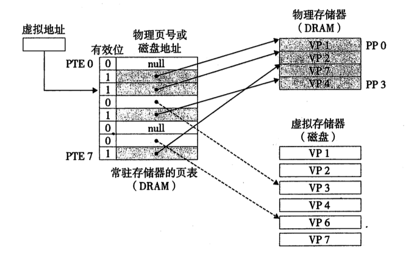

页表就是页表条目PTE的数据中。我们将假设PTE是有一个有效位和一个n位地址组成。有效位表明该虚拟页当前是否被缓存在DRAM。如果设置了有效位，则地址字段则表示DRAM中相应的物理页的起始位置。如果没有设置有效位，则这个地址指向该虚拟页在磁盘上的其实位置。（这仅仅是一种朴素的虚拟地址，实际比这复杂，见下文。）

假如地址位数有n，页表大小位2^p，则整个虚拟地址空间可以有2^(n-p)个页。

## 页命中/缺页

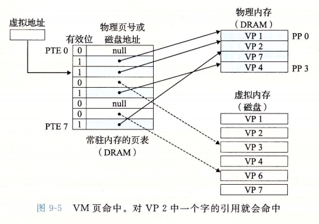

如果发生缺页，会触发一个缺页异常。缺页异常调用内核中的缺页异常处理程序，该程序会选择一个牺牲页。如果牺牲页已经被修改，那么内核就回将它复制回磁盘。（下图PTE[3]发生缺页）

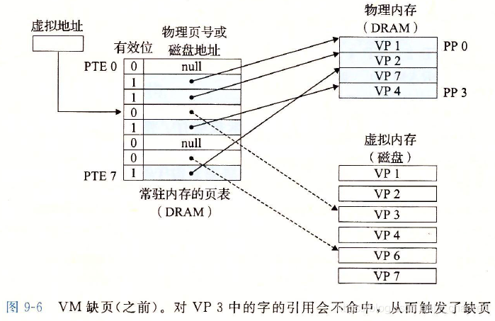

接下来，内核从磁盘复制程序所需的内容到物理内存中，并更新PTE[3]（使其指向对应的物理内存地址），随后返回。当异常处理程序返回，它回重新启动导致缺页的令。（可参考章节: [异常](./计算机/异常.html)）

## 分配页面

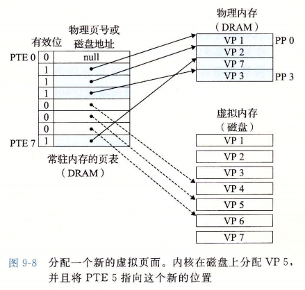

上图示例中，当分配页面的时候（例如调用malloc），先在磁盘创建空间，然后更新PTE[5]，使其指向对应的物理地址。（问题：当调用malloc，是否回立即分配物理内存？和swap的大小又有关系？）

## 局部性
在整个运行过程中，程序引用的不同页面的总数可能超出物理内存总的大小，但是局部性原则保证了在任意时刻，程序在趋向于在一个较小的活动页面（active page）集合上工作，这个集合叫做工作集或者常驻集合。在初始开销，也就是将工作集页面调度到内存之后，接下来对这个工作集的应用将导致命中，不会产生额外的页面中断和磁盘流量。因此，针对性能要求较高的程序，优秀的开发者在设计代码的时候会尽量考虑该项优化）

# 虚拟内存作为内存管理的工具
虚拟内存极大地简化了内存管理，并提供了一种自然的保护内存的方法。

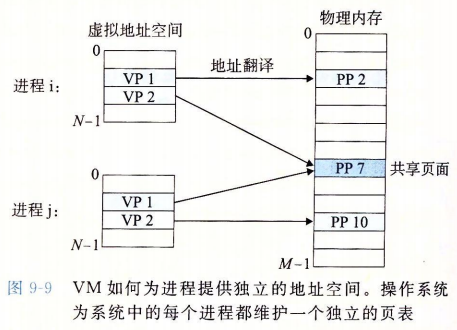

操作系统为每个进程提供了一个独立的页表，也就是一个独立的虚拟地址空间。VM因此简化了链接和加载、代码和数据共享，以及应用程序的内存分配。

- 简化链接：独立的地址空间允许每个进程的内存映像使用相同的基本格式，而不管代码和数据实际存放在物理内存的何处。例如，一个给定的linux系统上的每个进程都是用类似的内存格式。对于64位系统，代码段总是从虚拟地址0x400000开始。数据段在代码段之后，中间有一段符合要求的对其空白，栈占据用户进程地址空间最高的部分，并向下生长。这样的一致性，简化了链接器的设计和实现，允许链接器生成完全链接的可执行文件，使其独立于物理内存中代码和数据的最终位置。
- 简化加载：要把目标文件中的.text和.data节加载到一个新创建的进程中，linux加载器位代码和数据段分配虚拟页，把它们标记位无效（未被缓存），将页表条目指向目标文件中适当的位置。加载器不从磁盘到内存实际复制任何数据。在每个页被初次引用时，虚拟内存会按照需要自动调入数据页。将一组连续的虚拟页映射到任意一个文件中的任意位置的表示法称作内存映射。linxu提供一个称为mmap的系统调用，允许应用程序自己做内存映射。
- 简化共享：每个进程都有自己的虚拟地址空间，不和其他进程共享。然而，对于物理内存，不同的进程可以共享代码和数据。例如每个进程都必须调用相同的操作系统内核代码，而每个c程序都会调用c标准库中的程序，如printf。操作系统通过将不同进程中适当的虚拟页面印社到相同的物理页面，从而安排多个进程共享这部分代码的一个副本，而不是在每个进程中都包含单独的内核和c标准库的副本。（可见[链接-共享库](./计算机/链接.html)）
- 简化内存分配：当一个运行在用户进程中的程序要求额外的堆空间时（如malloc），操作系统分配一个适当数字（例如k）个连续的虚拟内存页面，并且将它们映射到物理内存中任意位置的k个任意的物理页面（可能随机在物理内存中随机分布）。

# 虚拟内存作为内存保护的工具
通过在PTE上添加一些额外的许可位来控制一个虚拟页面内容的访问十分简单。

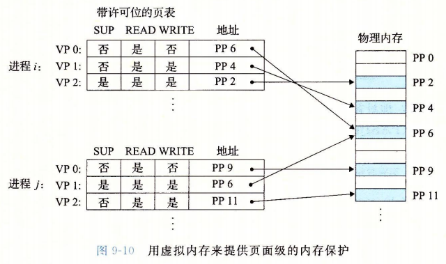

每个PTE中已经添加了三个许可位。SUP表示进程是否必须运行在内核（超级用户）模式下才能访问该页。运行在内核模式中的进程可以访问任何页面，但是用户模式中的进程只允许访问那些SUP位为0的页面。READ/WRITE控制对页面的读写。

如果一条指令违反了这些许可条件，那么CPU就触发一个一般保护故障，将控制传给一个内核中的异常处理程序。Linux shell一般将这种异常称为段错误（segmentation fault）。

# 地址翻译

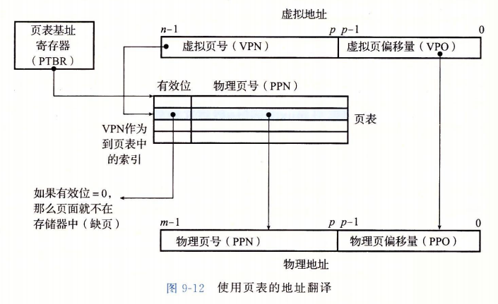

CPU中的一个控制寄存器，页表基址寄存器（PTBR）指向当前页表。n为的虚拟地址包含两部分：一个p位的虚拟页面偏移（VPO）和一个（n-p）位的虚拟页号。MMU利用VPN来选择适当的PTE，从中提取对应的物理页号PPN，将物理页号和VPO串联，就得到相应的物理地址。

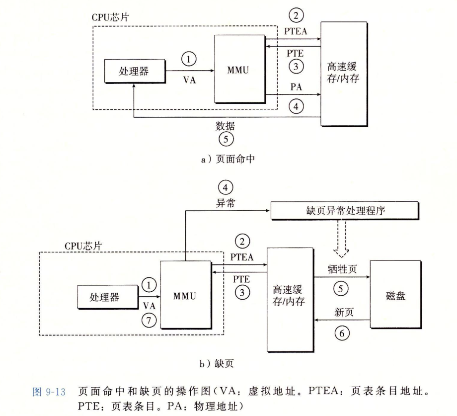

页面命中完全是由硬件处理的，与之不同的是，处理缺页要求硬件和操作系统内核协同完成。

## 结合高速缓存和虚拟内存

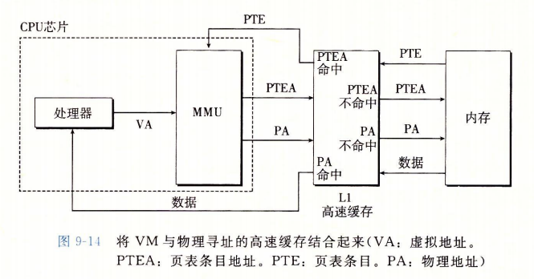

在任何既使用虚拟内存又使用SRAM高速缓存的系统中，都有应该使用虚拟地址还是使用物理地址来访问SRAM高速缓存的问题。但是大多数系统是选择物理寻址的。使用物理寻址，多个进程同时在高速缓存中有存储块和共享来自相同虚拟页面的块称为简单的事情。而且，高速缓存无需处理保护问题：访问权限的检查是地址翻译过程的一部分。

## 利用TLB加速地址翻译
每次CPU产生一次虚拟地址，MMU就必须查阅一次PTE，以将虚拟地址翻译位物理地址。在最糟糕的情况下，这回要求从内存多取一次数据。许多系统试图消除这种开销，它们在MMU中包含了一个关于PTE的小的缓存，称为翻译后背缓冲器TLB。

TLB是一个小的虚拟寻址的缓存，其中每一行都保存着一个由单个PTE组成的块。TLB同行有高度的相联度。

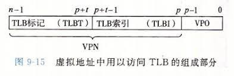

TLB索引 (TLBI)是从VPN的t个最低位组成的，而TLB标记（TLBT）是有VPN中剩余的位来组成的。

## 多级页表
假设系统32位，页大小KB，一个PTE 4B。那么一个进程的页表需要4MB驻留在内存中。对于64位的系统，需要的空间更高。

我们可以使用多级页表来减少页表的存储成本。将VPN划分位多个段落，每个段落表示一级。假如第k级使用n位，那么这一级就能表示2^n个页表是否至少有一个已经被分配。

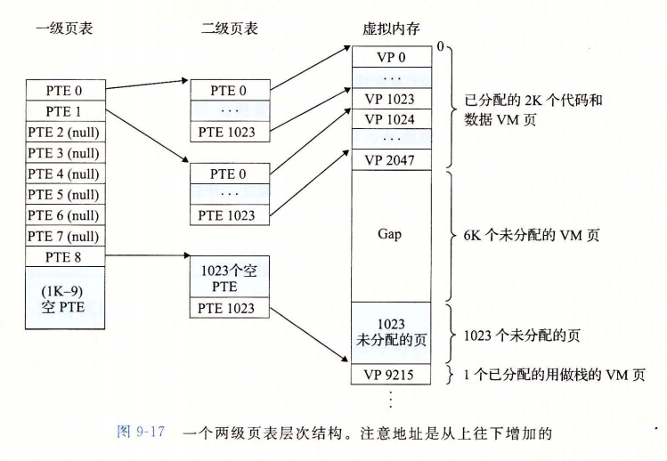

可能有人认为多级页表会降低访问速度，但得益于TLB，通过将不同层次上页表的PTE缓存起来，访问速度并不比单级页表慢很多。

问：
- 切换进程的时候，会对操作系统TLB做什么处理？
- CPU有个控制寄存器，存储了每个进程第一级页表的起始地址

# Linxu虚拟内存系统
每个进程共享内核的代码和全局数据结构。Linxu将一组连续的虚拟页面（大小等于系统中DRAM的总量）映射到相应的一组连续的物理页面。

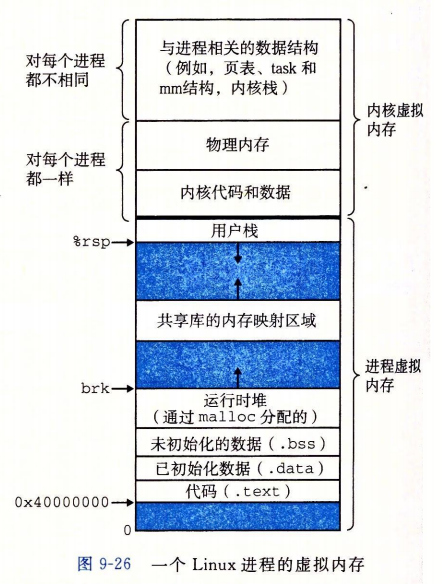

内核虚拟内存的其他区域包含每个进程都不相同的数据结构。比如说，页表、内核在进程的上下文中执行代码时使用的栈，以及记录虚拟地址空间当前组织的各种数据结构。

Linux将虚拟内存组织成一些区域（页叫做段）的集合。一个区域就是已经存在这的（已分配的）虚拟内存的连续片，这些页以某种方式相关联。例如，代码段、数据段、堆、共享库段，以及用户栈都是不同的区域。

内核位系统中每个进程维护一个单独的任务结构（源代码中的task_struct）。任务结构中的元素包含或者指向内核运行该进程所需的所有信息（如PID、指向用户栈的指针、可执行目标文件的名字，以及程序计数器等。）

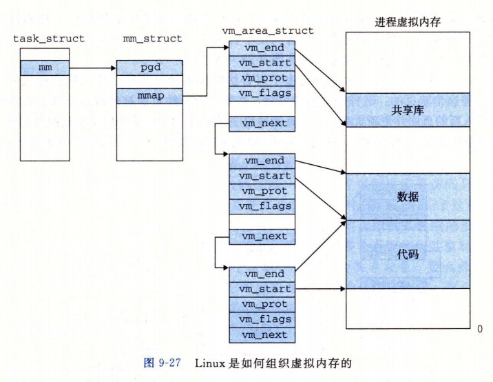

task_struct中有一个字段指向mm_struct，它描述了当前虚拟内存的状态。字段gpg指向第一级页表的基址，mmap指向一个vm_area_structs（区域结构）的链表，其中每个vm_area_structs都秒速了当前虚拟地址空间的一个区域/段。当内核运行这个进程时，就将pgd存放到CR3控制寄存器。MMU据此查询数据。

- vm_start、vm_end: 指向这个区域的开始、结束处
- vm_port：描述这个区域内包含的所有页的读写许可权限
- vm_flags：描述了这个区域内的页面是和其他进程共享，还是这个进程私有

缺页异常处理：当MMU试图翻译一个虚拟地址A，触发了一个缺页，这个异常会将控制转移到内核的缺页处理程序，处理程序含以下步骤：
- 判断A是否合法：A是否在某个区域结构定义的结构内。缺页处理程序会搜索区域结构的链表，把A和每个区域中的vm_start、vm_end做比较，如果执行不合法，会触发一个段错误，从而终止这个进程。（由于链表遍历消耗过大，linux在链表中构建了一颗树，从而加快搜索速度）
- 试图进程的内存访问是否合法：进程是否有读、写、执行这个区域页面的权限。